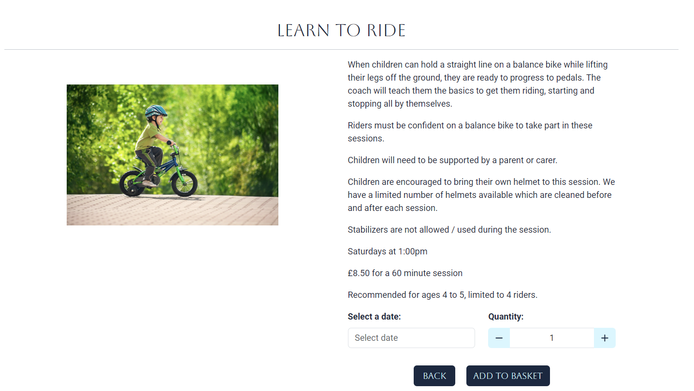
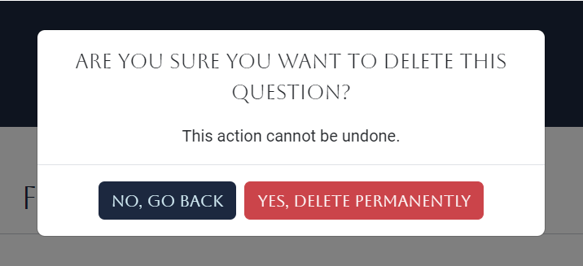
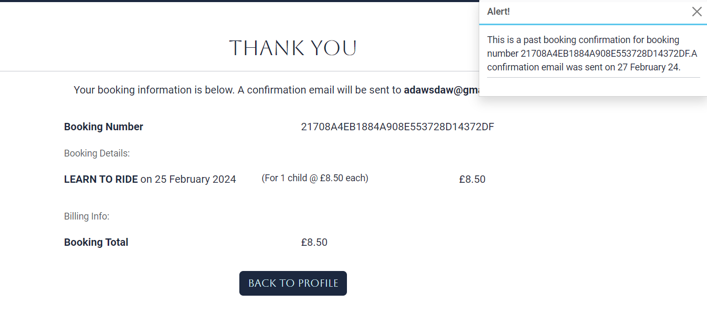

# [LITTLE RIDERS ACADEMY](https://little-riders-academy-7a3f050ed053.herokuapp.com)

Little Riders Academy is a website for a business which teaches cycling lessons to young children. Parents can view the different lessons available, as well as being able to book and pay for them on the website. Users can checkout as a guest, or they can choose to create an account where their information can be saved to their profile for a faster checkout in future. As a logged in user they can also leave a testimonial to be displayed on the website. Other features include a FAQs page and a contact form. Admin users can add, edit and delete lessons, add edit and delete FAQs, and view messages that customers have sent through the contact form.

The website is designed to be fully responsive, allowing visitors to view it on a wide range of devices.


I used [amiresponsive](https://ui.dev/amiresponsive?url=https://little-riders-academy-7a3f050ed053.herokuapp.com)
 to create this image.

## UX

### Colour Scheme

The website uses a plain white background with a navy-blue navbar and footer to give the site a clean look. Yellow and lighter blues are used for text on the dark background, buttons and hover effects. Although the lessons are aimed at children, the website itself is aimed at the parents who will be booking the lessons.

- `#192841` used for navbar, footer and the majority of buttons.
- `#FFFD37` used for navbar and footer text, and for hover effects on buttons.
- `#0ACDFF` used for hover effects on footer and other accents on forms and links.
- `#D6F7FF` used for hover effect on navbar and text on navy buttons.
- `#FFFFFF` used for the main background.

I used [coolors.co](https://coolors.co/192841-fffd37-0acdff-d6f7ff-ffffff) to generate my colour palette.


I've used CSS `:root` variables to easily update the global colour scheme by changing only one value, instead of everywhere in the CSS file. I have also used these root variables to create custom text, background and button classes to use throughout the site.

```css
:root {
    --navy: #192841;
    --yellow: #FFFD37;
    --sky-blue: #0ACDFF;
    --light-blue: #D6F7FF;
}
```

### Typography

- [Aboreto](https://fonts.google.com/specimen/Aboretot) was used for the primary headers and titles.

- [Roboto](https://fonts.google.com/?query=roboto) was used for all other secondary text.

- [Font Awesome](https://fontawesome.com) icons were used throughout the site, such as the social media icons in the footer.

## User Stories


### New Site Users

- As a new site user, I would like to find out what the business is about , so that I can see if it would be suitable for me to use.
- As a new site user, I would like to view a list of the lessons available, so that I can see if any of them are suitable for my child.
- As a new site user, I would like to view full details of each type of lesson, so that I view lesson days/times, price and full details so see if the lesson is suitable for my child.
- As a new site user, I would like to see what other customers think of the lessons, so that I can make an informed decision as to whether I want to use them.
- As a new site user, I would like to have basic questions about the lessons answered, so that I know all necessary information to be able to bring my child to them.
- As a new site user, I would like to contact the business owner, so that I can ask any additional questions I may have.

### New and Returning Site Users

- As a new/returning site user, I would like to easily select the date and quantity for lessons I want to book, so that I can book lessons on the correct date and for the correct number of children.
- As a new/returning site user, I would like to easily add lessons to my basket, so that I can book and pay for more than one at a time.
- As a new/returning site user, I would like to see a brief overview of my basket once I have added lessons to it, so that I can book and pay for more than one at a time.
- As a new/returning site user, I would like to view the lessons in my basket, so I can check I am happy with all the details before booking/paying.
- As a new/returning site user, I would like to easily edit the lessons in my basket, so that I can fix any errors/change my mind without having to go back and start again.
- As a new/returning site user, I would like to easily remove lessons from my basket, so that I can correct any error or change my mind.
- As a new/returning site user, I would like to book and pay for a lesson for my child, so that my child can attend the lesson.
- As a new/returning site user, I would like to easily enter my payment information, so that I can book the lesson.
- As a new/returning site user, I would like to feel my payment information is safe and secure, so that I can confidently provide the information needed to make a purchase.
- As a new/returning site user, I would like to view a booking confirmation after checkout, so that I know that the booking has been successful.
- As a new/returning site user, I would like to receive an email confirmation after checking out, so that I keep the confirmation for my records.

### Returning Site Users

- As a returning site user, I would like to easily create an account, so that I can checkout faster in the future.
- As a returning site user, I would like to receive a confirmation email after registering, so that I know that my account registration was successful.
- As a returning site user, I would like to easily login or logout, so that I can access my personal account information.
- As a returning site user, I would like to easily view my bookings at any time, so that I can see how many lessons my child has attended in the past and any which are coming up in the future.
- As a returning site user, I would like to have a personalised user profile, so that I can save my details and checkout faster in future.
- As a returning site user, I would like to leave a testimonial, so that I can let other users know what I think of the lessons.

### Site Admin

- As a site administrator, I should be able to add a new lesson to the site, so that I can offer more types of lessons to customers.
- As a site administrator, I should be able to edit a lesson, so that I can change the details of the classes.
- As a site administrator, I should be able to delete a lesson, so that I can stop offering lessons which are unable to run.
- As a site administrator, I should be asked to confirm whether I want to delete/edit a lesson, so that I can't accidentally perform these actions.
- As a site administrator, I should be able to view customer messages that have been sent through the contact app, so that I can answer customer queries.
- As a site administrator, I should be able to add a FAQ, so that I can reduce the amount of contact emails I am receiving.
- As a site administrator, I should be able to edit a FAQ, so that I can reduce the amount of contact emails I am receiving.
- As a site administrator, I should be asked to confirm whether I want to delete/edit an FAQ, so that I can't accidentally perform these actions.
- As a site administrator, I should be able to see messages to confirm whether all these actions have been successful.


## Wireframes

🛑🛑🛑🛑🛑 START OF NOTES (to be deleted) 🛑🛑🛑🛑🛑

In this section, display your wireframe screenshots using a Markdown `table`.
Instructions on how to do Markdown `tables` start on line #213 on this site: https://pandao.github.io/editor.md/en.html

Alternatively, dropdowns are a way to condense several wireframes into a collapsible menu to save space.
Dropdowns in Markdown are considered some of the only acceptable HTML components that are allowed for assessment purposes.

**IMPORTANT**! **IMPORTANT**! **IMPORTANT**!
The example below uses the `details` and `summary` code elements.
However, for these scripts to work, I've had to add spaces within the `< >` elements.

You MUST remove these spaces for it to work properly on your own README/TESTING files.
Remove the spaces within the `< >` brackets for the `details` and `summary` code elements,
for the Mobile, Tablet, and Desktop wireframes.

🛑🛑🛑🛑🛑 END OF NOTES (to be deleted) 🛑🛑🛑🛑🛑

To follow best practice, wireframes were developed for mobile, tablet, and desktop sizes.
I've used [Balsamiq](https://balsamiq.com/wireframes) to design my site wireframes.

### Mobile Wireframes

< details >
< summary > Click here to see the Mobile Wireframes < / summary >

Home
  - 

About
  - 

Contact
  - 

Gallery
  - 

etc.
  - repeat for any remaining mobile wireframes

< / details >

### Tablet Wireframes

< details >
< summary > Click here to see the Tablet Wireframes < / summary >

Home
  - 

About
  - 

Contact
  - 

Gallery
  - 

etc.
  - repeat for any remaining tablet wireframes

< / details >

### Desktop Wireframes

< details >
< summary > Click here to see the Desktop Wireframes < / summary >

Home
  - 

About
  - 

Contact
  - 

Gallery
  - 

etc.
  - repeat for any remaining desktop wireframes

< / details >

## Features

### Existing Features

#### All Pages on the Site Have:

- **Navbar**

    - A responsive navbar displayed clearly at the top of the page which allows the user to navigate around the site. On the left of the navbar is the business logo which also acts as a link back to the home page. On the right are links to the lesson, FAQs and contat pages, as well as an account dropdown menu which will show different options depending on if the user is logged in/out and whether they are a superuser.


- **Navbar mobile toggler**

    - On screen sizes of medium and below, the navbar collapses to a burger toggler. This gives the navbar a clean look and stops it becoming too cluttered. Both the burger icon and dropdown menu are on the right side of the screen, this provides a good user experience as most users would use their right thumb to click on the icon and then the dropdown menu appears in close proximity to it. Once the navbar has collapsed the basket link moves to a button placed at the bottom right of the page.


- **Footer**

    - The footer contains links to the external Facebook, Instagram and YouTube sites of the group which all open in new tabs. It also has a link to the Contact page of the website which opens in the same window. Universally recognisable icons were used rather than text to the give the footer a clean look. The icons change color when hovered over to give instant feedback to the user.


#### Home Page

- **Hero Image**

    - Details about this particular feature, including the value to the site, and benefit for the user. Be as detailed as possible!


- **About Us Section**

    - Details about this particular feature, including the value to the site, and benefit for the user. Be as detailed as possible!


- **Testimonials Section**

    - Details about this particular feature, including the value to the site, and benefit for the user. Be as detailed as possible!


#### Lessons Page

- **Lessons Cards**

    - Details about this particular feature, including the value to the site, and benefit for the user. Be as detailed as possible!


- **Add New Lesson Button**

    - Details about this particular feature, including the value to the site, and benefit for the user. Be as detailed as possible!


#### Lesson Details Page

- **Lesson Full Details**

    - Details about this particular feature, including the value to the site, and benefit for the user. Be as detailed as possible!




- **Lesson Details Edit and Delete Buttons**

    - Details about this particular feature, including the value to the site, and benefit for the user. Be as detailed as possible!


- **Delete Lesson Modal**

    - Details about this particular feature, including the value to the site, and benefit for the user. Be as detailed as possible!


- **Datepicker**

    - Details about this particular feature, including the value to the site, and benefit for the user. Be as detailed as possible!


- **Quantity Buttons**

    - Details about this particular feature, including the value to the site, and benefit for the user. Be as detailed as possible!


- **Add to Basket Buttons**

    - Details about this particular feature, including the value to the site, and benefit for the user. Be as detailed as possible!


#### Add Lesson Page

- **Add Lesson Form**

    - Details about this particular feature, including the value to the site, and benefit for the user. Be as detailed as possible!


- **Add Lesson Form Buttons**

    - Details about this particular feature, including the value to the site, and benefit for the user. Be as detailed as possible!


#### Edit Lesson Page

- **Edit Lesson Form**

    - Details about this particular feature, including the value to the site, and benefit for the user. Be as detailed as possible!


- **Edit Lesson Buttons**

    - Details about this particular feature, including the value to the site, and benefit for the user. Be as detailed as possible!


- **Edit Lesson Modal**

    - Details about this particular feature, including the value to the site, and benefit for the user. Be as detailed as possible!


#### FAQs Page

- **FAQs Accordian**

    - Details about this particular feature, including the value to the site, and benefit for the user. Be as detailed as possible!


- **FAQs Add Question Button**

    - Details about this particular feature, including the value to the site, and benefit for the user. Be as detailed as possible!


- **FAQs Edit and Delete Buttons**

    - Details about this particular feature, including the value to the site, and benefit for the user. Be as detailed as possible!


- **FAQs Delete Modal**

    - Details about this particular feature, including the value to the site, and benefit for the user. Be as detailed as possible!



- **FAQs Add Question Form**

    - Details about this particular feature, including the value to the site, and benefit for the user. Be as detailed as possible!


- **FAQs Edit Question Form**

    - Details about this particular feature, including the value to the site, and benefit for the user. Be as detailed as possible!


- **FAQs Edit Question Modal**

    - Details about this particular feature, including the value to the site, and benefit for the user. Be as detailed as possible!


#### Contact Page

- **Contact Form**

    - Details about this particular feature, including the value to the site, and benefit for the user. Be as detailed as possible!


#### View Queries Page

- **View Queries Accordian**

    - Details about this particular feature, including the value to the site, and benefit for the user. Be as detailed as possible!


#### Leave a Testimonial Page

- **Testimonial Form**

    - Details about this particular feature, including the value to the site, and benefit for the user. Be as detailed as possible!


#### Profile Page

- **Profile Information Update Form and Past Booking Overview**

    - Details about this particular feature, including the value to the site, and benefit for the user. Be as detailed as possible!


- **Past Booking Details**

    - Details about this particular feature, including the value to the site, and benefit for the user. Be as detailed as possible!



#### Basket Page

- **Basket Overview Message**

    - Details about this particular feature, including the value to the site, and benefit for the user. Be as detailed as possible!


- **Basket Items Details**

    - Details about this particular feature, including the value to the site, and benefit for the user. Be as detailed as possible!


- **Basket Adjust**

    - Details about this particular feature, including the value to the site, and benefit for the user. Be as detailed as possible!


#### Checkout Page

- **Checkout Booking Details Form and Booking Summary**

    - Details about this particular feature, including the value to the site, and benefit for the user. Be as detailed as possible!


- **Checkout Button**

    - Details about this particular feature, including the value to the site, and benefit for the user. Be as detailed as possible!


- **Checkout Payment Input**

    - Details about this particular feature, including the value to the site, and benefit for the user. Be as detailed as possible!


- **Checkout Sign Up/ Sign In Links**

    - Details about this particular feature, including the value to the site, and benefit for the user. Be as detailed as possible!


- **Checkout Logged In User Booking Details Form and Booking Summary**

    - Details about this particular feature, including the value to the site, and benefit for the user. Be as detailed as possible!


- **Checkout Save Info Checkbox**

    - Details about this particular feature, including the value to the site, and benefit for the user. Be as detailed as possible!


#### Checkout Success Page

- **Booking Summary Message**

    - Details about this particular feature, including the value to the site, and benefit for the user. Be as detailed as possible!


- **Booking Confirmation and Details**

    - Details about this particular feature, including the value to the site, and benefit for the user. Be as detailed as possible!


- **Booking Confirmation Email**

    - Details about this particular feature, including the value to the site, and benefit for the user. Be as detailed as possible!


### Future Features

🛑🛑🛑🛑🛑 START OF NOTES (to be deleted) 🛑🛑🛑🛑🛑

Do you have additional ideas that you'd like to include on your project in the future?
Fantastic! List them here!
It's always great to have plans for future improvements!
Consider adding any helpful links or notes to help remind you in the future, if you revisit the project in a couple years.

🛑🛑🛑🛑🛑 END OF NOTES (to be deleted) 🛑🛑🛑🛑🛑

- Title for future feature #1
    - Any additional notes about this feature.
- Title for future feature #2
    - Any additional notes about this feature.
- Title for future feature #3
    - Any additional notes about this feature.

## Tools & Technologies Used

🛑🛑🛑🛑🛑 START OF NOTES (to be deleted) 🛑🛑🛑🛑🛑

In this section, you should explain the various tools and technologies used to develop the project.
Make sure to put a link (where applicable) to the source, and explain what each was used for.
Some examples have been provided, but this is just a sample only, your project might've used others.
Feel free to delete any unused items below as necessary.

🛑🛑🛑🛑🛑 END OF NOTES (to be deleted) 🛑🛑🛑🛑🛑

- [HTML](https://en.wikipedia.org/wiki/HTML) used for the main site content.
- [CSS](https://en.wikipedia.org/wiki/CSS) used for the main site design and layout.
- [CSS :root variables](https://www.w3schools.com/css/css3_variables.asp) used for reusable styles throughout the site.
- [CSS Flexbox](https://www.w3schools.com/css/css3_flexbox.asp) used for an enhanced responsive layout.
- [CSS Grid](https://www.w3schools.com/css/css_grid.asp) used for an enhanced responsive layout.
- [JavaScript](https://www.javascript.com) used for user interaction on the site.
- [Python](https://www.python.org) used as the back-end programming language.
- [Git](https://git-scm.com) used for version control. (`git add`, `git commit`, `git push`)
- [GitHub](https://github.com) used for secure online code storage.
- [GitHub Pages](https://pages.github.com) used for hosting the deployed front-end site.
- [Gitpod](https://gitpod.io) used as a cloud-based IDE for development.
- [Codeanywhere](https://codeanywhere.com) used as a cloud-based IDE for development.
- [Bootstrap](https://getbootstrap.com) used as the front-end CSS framework for modern responsiveness and pre-built components.
- [Materialize](https://materializecss.com) used as the front-end CSS framework for modern responsiveness and pre-built components.
- [Flask](https://flask.palletsprojects.com) used as the Python framework for the site.
- [Django](https://www.djangoproject.com) used as the Python framework for the site.
- [MongoDB](https://www.mongodb.com) used as the non-relational database management with Flask.
- [SQLAlchemy](https://www.sqlalchemy.org) used as the relational database management with Flask.
- [PostgreSQL](https://www.postgresql.org) used as the relational database management.
- [ElephantSQL](https://www.elephantsql.com) used as the Postgres database.
- [Heroku](https://www.heroku.com) used for hosting the deployed back-end site.
- [Cloudinary](https://cloudinary.com) used for online static file storage.
- [Stripe](https://stripe.com) used for online secure payments of ecommerce products/services.
- [AWS S3](https://aws.amazon.com/s3) used for online static file storage.

## Database Design

Entity Relationship Diagrams (ERD) help to visualize database architecture before creating models.
Understanding the relationships between different tables can save time later in the project.

🛑🛑🛑🛑🛑 START OF NOTES (to be deleted) 🛑🛑🛑🛑🛑

Using your defined models (one example below), create an ERD with the relationships identified.

🛑🛑🛑🛑🛑 END OF NOTES (to be deleted) 🛑🛑🛑🛑🛑

```python
class Product(models.Model):
    category = models.ForeignKey(
        "Category", null=True, blank=True, on_delete=models.SET_NULL)
    sku = models.CharField(max_length=254, null=True, blank=True)
    name = models.CharField(max_length=254)
    description = models.TextField()
    has_sizes = models.BooleanField(default=False, null=True, blank=True)
    price = models.DecimalField(max_digits=6, decimal_places=2)
    rating = models.DecimalField(
        max_digits=6, decimal_places=2, null=True, blank=True)
    image_url = models.URLField(max_length=1024, null=True, blank=True)
    image = models.ImageField(null=True, blank=True)

    def __str__(self):
        return self.name
```

🛑🛑🛑🛑🛑 START OF NOTES (to be deleted) 🛑🛑🛑🛑🛑

A couple recommendations for building free ERDs:
- [Draw.io](https://draw.io)
- [Lucidchart](https://www.lucidchart.com/pages/ER-diagram-symbols-and-meaning)

🛑🛑🛑🛑🛑 END OF NOTES (to be deleted) 🛑🛑🛑🛑🛑


🛑🛑🛑🛑🛑 START OF NOTES (to be deleted) 🛑🛑🛑🛑🛑

Using Markdown formatting to represent an example ERD table using the Product model above:

🛑🛑🛑🛑🛑 END OF NOTES (to be deleted) 🛑🛑🛑🛑🛑

- Table: **Product**

    | **PK** | **id** (unique) | Type | Notes |
    | --- | --- | --- | --- |
    | **FK** | category | ForeignKey | FK to **Category** model |
    | | sku | CharField | |
    | | name | CharField | |
    | | description | TextField | |
    | | has_sizes | BooleanField | |
    | | price | DecimalField | |
    | | rating | DecimalField | |
    | | image_url | URLField | |
    | | image | ImageField | |

## Testing

For all testing, please refer to the [TESTING.md](TESTING.md) file.

## Deployment

The live deployed application can be found deployed on [Heroku](https://little-riders-academy-7a3f050ed053.herokuapp.com).

### ElephantSQL Database

This project uses [ElephantSQL](https://www.elephantsql.com) for the PostgreSQL Database.

To obtain your own Postgres Database, sign-up with your GitHub account, then follow these steps:

- Click **Create New Instance** to start a new database.
- Provide a name (this is commonly the name of the project: little-riders-academy).
- Select the **Tiny Turtle (Free)** plan.
- You can leave the **Tags** blank.
- Select the **Region** and **Data Center** closest to you.
- Once created, click on the new database name, where you can view the database URL and Password.

### Amazon AWS

This project uses [AWS](https://aws.amazon.com) to store media and static files online, due to the fact that Heroku doesn't persist this type of data.

Once you've created an AWS account and logged-in, follow these series of steps to get your project connected.
Make sure you're on the **AWS Management Console** page.

#### S3 Bucket

- Search for **S3**.
- Create a new bucket, give it a name (matching your Heroku app name), and choose the region closest to you.
- Uncheck **Block all public access**, and acknowledge that the bucket will be public (required for it to work on Heroku).
- From **Object Ownership**, make sure to have **ACLs enabled**, and **Bucket owner preferred** selected.
- From the **Properties** tab, turn on static website hosting, and type `index.html` and `error.html` in their respective fields, then click **Save**.
- From the **Permissions** tab, paste in the following CORS configuration:

	```shell
	[
		{
			"AllowedHeaders": [
				"Authorization"
			],
			"AllowedMethods": [
				"GET"
			],
			"AllowedOrigins": [
				"*"
			],
			"ExposeHeaders": []
		}
	]
	```

- Copy your **ARN** string.
- From the **Bucket Policy** tab, select the **Policy Generator** link, and use the following steps:
	- Policy Type: **S3 Bucket Policy**
	- Effect: **Allow**
	- Principal: `*`
	- Actions: **GetObject**
	- Amazon Resource Name (ARN): **paste-your-ARN-here**
	- Click **Add Statement**
	- Click **Generate Policy**
	- Copy the entire Policy, and paste it into the **Bucket Policy Editor**

		```shell
		{
			"Id": "Policy1234567890",
			"Version": "2012-10-17",
			"Statement": [
				{
					"Sid": "Stmt1234567890",
					"Action": [
						"s3:GetObject"
					],
					"Effect": "Allow",
					"Resource": "arn:aws:s3:::your-bucket-name/*"
					"Principal": "*",
				}
			]
		}
		```

	- Before you click "Save", add `/*` to the end of the Resource key in the Bucket Policy Editor (like above).
	- Click **Save**.
- From the **Access Control List (ACL)** section, click "Edit" and enable **List** for **Everyone (public access)**, and accept the warning box.
	- If the edit button is disabled, you need to change the **Object Ownership** section above to **ACLs enabled** (mentioned above).

#### IAM

Back on the AWS Services Menu, search for and open **IAM** (Identity and Access Management).
Once on the IAM page, follow these steps:

- From **User Groups**, click **Create New Group**.
	- Suggested Name: `group-little-riders-academy` (group + the project name)
- Tags are optional, but you must click it to get to the **review policy** page.
- From **User Groups**, select your newly created group, and go to the **Permissions** tab.
- Open the **Add Permissions** dropdown, and click **Attach Policies**.
- Select the policy, then click **Add Permissions** at the bottom when finished.
- From the **JSON** tab, select the **Import Managed Policy** link.
	- Search for **S3**, select the `AmazonS3FullAccess` policy, and then **Import**.
	- You'll need your ARN from the S3 Bucket copied again, which is pasted into "Resources" key on the Policy.

		```shell
		{
			"Version": "2012-10-17",
			"Statement": [
				{
					"Effect": "Allow",
					"Action": "s3:*",
					"Resource": [
						"arn:aws:s3:::your-bucket-name",
						"arn:aws:s3:::your-bucket-name/*"
					]
				}
			]
		}
		```
	
	- Click **Review Policy**.
	- Suggested Name: `policy-little-riders-academy` (policy + the project name)
	- Provide a description:
		- "Access to S3 Bucket for little-riders-academy static files."
	- Click **Create Policy**.
- From **User Groups**, click your "group-little-riders-academy".
- Click **Attach Policy**.
- Search for the policy you've just created ("policy-little-riders-academy") and select it, then **Attach Policy**.
- From **User Groups**, click **Add User**.
	- Suggested Name: `user-little-riders-academy` (user + the project name)
- For "Select AWS Access Type", select **Programmatic Access**.
- Select the group to add your new user to: `group-little-riders-academy`
- Tags are optional, but you must click it to get to the **review user** page.
- Click **Create User** once done.
- You should see a button to **Download .csv**, so click it to save a copy on your system.
	- **IMPORTANT**: once you pass this page, you cannot come back to download it again, so do it immediately!
	- This contains the user's **Access key ID** and **Secret access key**.
	- `AWS_ACCESS_KEY_ID` = **Access key ID**
	- `AWS_SECRET_ACCESS_KEY` = **Secret access key**

#### Final AWS Setup

- If Heroku Config Vars has `DISABLE_COLLECTSTATIC` still, this can be removed now, so that AWS will handle the static files.
- Back within **S3**, create a new folder called: `media`.
- Select any existing media images for your project to prepare them for being uploaded into the new folder.
- Under **Manage Public Permissions**, select **Grant public read access to this object(s)**.
- No further settings are required, so click **Upload**.

### Stripe API

This project uses [Stripe](https://stripe.com) to handle the ecommerce payments.

Once you've created a Stripe account and logged-in, follow these series of steps to get your project connected.

- From your Stripe dashboard, click to expand the "Get your test API keys".
- You'll have two keys here:
	- `STRIPE_PUBLIC_KEY` = Publishable Key (starts with **pk**)
	- `STRIPE_SECRET_KEY` = Secret Key (starts with **sk**)

As a backup, in case users prematurely close the purchase-order page during payment, we can include Stripe Webhooks.

- From your Stripe dashboard, click **Developers**, and select **Webhooks**.
- From there, click **Add Endpoint**.
	- `https://little-riders-academy-7a3f050ed053.herokuapp.com/checkout/wh/`
- Click **receive all events**.
- Click **Add Endpoint** to complete the process.
- You'll have a new key here:
	- `STRIPE_WH_SECRET` = Signing Secret (Wehbook) Key (starts with **wh**)

### Gmail API

This project uses [Gmail](https://mail.google.com) to handle sending emails to users for account verification and purchase order confirmations.

Once you've created a Gmail (Google) account and logged-in, follow these series of steps to get your project connected.

- Click on the **Account Settings** (cog icon) in the top-right corner of Gmail.
- Click on the **Accounts and Import** tab.
- Within the section called "Change account settings", click on the link for **Other Google Account settings**.
- From this new page, select **Security** on the left.
- Select **2-Step Verification** to turn it on. (verify your password and account)
- Once verified, select **Turn On** for 2FA.
- Navigate back to the **Security** page, and you'll see a new option called **App passwords**.
- This might prompt you once again to confirm your password and account.
- Select **Mail** for the app type.
- Select **Other (Custom name)** for the device type.
	- Any custom name, such as "Django" or little-riders-academy
- You'll be provided with a 16-character password (API key).
	- Save this somewhere locally, as you cannot access this key again later!
	- `EMAIL_HOST_PASS` = user's 16-character API key
	- `EMAIL_HOST_USER` = user's own personal Gmail email address

### Heroku Deployment

This project uses [Heroku](https://www.heroku.com), a platform as a service (PaaS) that enables developers to build, run, and operate applications entirely in the cloud.

Deployment steps are as follows, after account setup:

- Select **New** in the top-right corner of your Heroku Dashboard, and select **Create new app** from the dropdown menu.
- Your app name must be unique, and then choose a region closest to you (EU or USA), and finally, select **Create App**.
- From the new app **Settings**, click **Reveal Config Vars**, and set your environment variables.

| Key | Value |
| --- | --- |
| `AWS_ACCESS_KEY_ID` | user's own value |
| `AWS_SECRET_ACCESS_KEY` | user's own value |
| `DATABASE_URL` | user's own value |
| `DISABLE_COLLECTSTATIC` | 1 (*this is temporary, and can be removed for the final deployment*) |
| `EMAIL_HOST_PASS` | user's own value |
| `EMAIL_HOST_USER` | user's own value |
| `SECRET_KEY` | user's own value |
| `STRIPE_PUBLIC_KEY` | user's own value |
| `STRIPE_SECRET_KEY` | user's own value |
| `STRIPE_WH_SECRET` | user's own value |
| `USE_AWS` | True |

Heroku needs two additional files in order to deploy properly.

- requirements.txt
- Procfile

You can install this project's **requirements** (where applicable) using:

- `pip3 install -r requirements.txt`

If you have your own packages that have been installed, then the requirements file needs updated using:

- `pip3 freeze --local > requirements.txt`

The **Procfile** can be created with the following command:

- `echo web: gunicorn app_name.wsgi > Procfile`
- *replace **app_name** with the name of your primary Django app name; the folder where settings.py is located*

For Heroku deployment, follow these steps to connect your own GitHub repository to the newly created app:

Either:

- Select **Automatic Deployment** from the Heroku app.

Or:

- In the Terminal/CLI, connect to Heroku using this command: `heroku login -i`
- Set the remote for Heroku: `heroku git:remote -a app_name` (replace *app_name* with your app name)
- After performing the standard Git `add`, `commit`, and `push` to GitHub, you can now type:
	- `git push heroku main`

The project should now be connected and deployed to Heroku!

### Local Deployment

This project can be cloned or forked in order to make a local copy on your own system.

For either method, you will need to install any applicable packages found within the *requirements.txt* file.

- `pip3 install -r requirements.txt`.

You will need to create a new file called `env.py` at the root-level,
and include the same environment variables listed above from the Heroku deployment steps.

Sample `env.py` file:

```python
import os

os.environ.setdefault("AWS_ACCESS_KEY_ID", "user's own value")
os.environ.setdefault("AWS_SECRET_ACCESS_KEY", "user's own value")
os.environ.setdefault("DATABASE_URL", "user's own value")
os.environ.setdefault("EMAIL_HOST_PASS", "user's own value")
os.environ.setdefault("EMAIL_HOST_USER", "user's own value")
os.environ.setdefault("SECRET_KEY", "user's own value")
os.environ.setdefault("STRIPE_PUBLIC_KEY", "user's own value")
os.environ.setdefault("STRIPE_SECRET_KEY", "user's own value")
os.environ.setdefault("STRIPE_WH_SECRET", "user's own value")

# local environment only (do not include these in production/deployment!)
os.environ.setdefault("DEBUG", "True")
```

Once the project is cloned or forked, in order to run it locally, you'll need to follow these steps:

- Start the Django app: `python3 manage.py runserver`
- Stop the app once it's loaded: `CTRL+C` or `⌘+C` (Mac)
- Make any necessary migrations: `python3 manage.py makemigrations`
- Migrate the data to the database: `python3 manage.py migrate`
- Create a superuser: `python3 manage.py createsuperuser`
- Load fixtures (if applicable): `python3 manage.py loaddata file-name.json` (repeat for each file)
- Everything should be ready now, so run the Django app again: `python3 manage.py runserver`

If you'd like to backup your database models, use the following command for each model you'd like to create a fixture for:

- `python3 manage.py dumpdata your-model > your-model.json`
- *repeat this action for each model you wish to backup*

#### Cloning

You can clone the repository by following these steps:

1. Go to the [GitHub repository](https://github.com/laurabolwell/little-riders-academy) 
2. Locate the Code button above the list of files and click it 
3. Select if you prefer to clone using HTTPS, SSH, or GitHub CLI and click the copy button to copy the URL to your clipboard
4. Open Git Bash or Terminal
5. Change the current working directory to the one where you want the cloned directory
6. In your IDE Terminal, type the following command to clone my repository:
	- `git clone https://github.com/laurabolwell/little-riders-academy.git`
7. Press Enter to create your local clone.

Alternatively, if using Gitpod, you can click below to create your own workspace using this repository.

[](https://gitpod.io/#https://github.com/laurabolwell/little-riders-academy)

Please note that in order to directly open the project in Gitpod, you need to have the browser extension installed.
A tutorial on how to do that can be found [here](https://www.gitpod.io/docs/configure/user-settings/browser-extension).

#### Forking

By forking the GitHub Repository, we make a copy of the original repository on our GitHub account to view and/or make changes without affecting the original owner's repository.
You can fork this repository by using the following steps:

1. Log in to GitHub and locate the [GitHub Repository](https://github.com/laurabolwell/little-riders-academy)
2. At the top of the Repository (not top of page) just above the "Settings" Button on the menu, locate the "Fork" Button.
3. Once clicked, you should now have a copy of the original repository in your own GitHub account!

### Local VS Deployment

There are no known differences between the local development site and the live deployed version on Heroku.

## Credits

### Content

| Source | Location | Notes |
| --- | --- | --- |
| [Markdown Builder](https://tim.2bn.dev/markdown-builder) | README and TESTING | tool to help generate the Markdown files |
| [Chris Beams](https://chris.beams.io/posts/git-commit) | version control | "How to Write a Git Commit Message" |
| [W3Schools](https://www.w3schools.com/howto/howto_js_topnav_responsive.asp) | entire site | responsive HTML/CSS/JS navbar |
| [W3Schools](https://www.w3schools.com/howto/howto_css_modals.asp) | contact page | interactive pop-up (modal) |
| [W3Schools](https://www.w3schools.com/css/css3_variables.asp) | entire site | how to use CSS :root variables |
| [Django Documentation](https://docs.djangoproject.com/en/5.0/ref/templates/builtins/) | entire site | Using template tags to format dates |
| [strftime](https://strftime.org) | CRUD functionality | helpful tool to format date/time from string |
| [FreeCodeCamp](https://www.freecodecamp.org/news/javascript-date-format-how-to-format-a-date-in-js/) | basket update/delete buttons | Changing date format in javascript |
| [StackOverflow](https://stackoverflow.com/questions/31106189/create-a-simple-10-second-countdown) | error pages | 10 second countdown timer |
| [Django Project Forum](https://forum.djangoproject.com/t/pass-template-content-variable-to-javascript/22313) | lesson details page | passing template variables to js file |
| [StackOverflow](https://stackoverflow.com/questions/13371765/how-to-find-the-previous-sibling-of-parent3) | basket template js | finding previous sibling of parent |
| [W3 Schools](https://www.w3schools.com/js/js_loop_for.asp) | home page postload script | used to generate the testimonial stars |
| [Django Documentation](https://docs.djangoproject.com/en/5.0/topics/testing/) | entire site | used for writing python tests |

### Media

| Source | Location | Type | Notes |
| --- | --- | --- | --- |
| [LOGO.com](https://app.logo.com) | entire site | image | favicon on all pages |
| [LOGO.com](https://app.logo.com) | entire site | image | navbar logo |
| [LOGO.com](https://app.logo.com) | home page | image | large logo on hero image |
| [Shutterstock](https://www.shutterstock.com/image-photo/three-little-children-riding-their-bikes-81178267) | home page | image | hero image |
| [Shutterstock](https://www.shutterstock.com/image-photo/children-riding-balance-bike-kids-on-679831909) | lessons and lesson details pages | image | balance bike lesson image |
| [Shutterstock](https://www.shutterstock.com/image-photo/boy-helmet-riding-bike-107757644) | lessons and lesson details pages | image | learn to ride lesson image |
| [Shutterstock](https://www.shutterstock.com/image-photo/smiling-children-posing-bikes-park-573149200) | lessons and lesson details pages | image | first pedals lesson image |
| [Shutterstock](https://www.shutterstock.com/image-photo/portrait-three-little-cyclists-riding-their-81178237) | lessons and lesson details pages | image | cycle skills lesson image |
| [TinyPNG](https://tinypng.com) | entire site | image | tool for image compression |

### Acknowledgements

- I would like to thank my Code Institute mentor, [Tim Nelson](https://github.com/TravelTimN) for his outstanding support and guidance throughout the development of this project.
- I would like to thank the [Code Institute](https://codeinstitute.net) tutor team for their assistance with troubleshooting and debugging some project issues.
- I would like to thank the [Code Institute Slack community](https://code-institute-room.slack.com) for the moral support; it kept me going during periods of self doubt and imposter syndrome.
- I would like to thank my partner Lewis, for believing in me, and allowing me to make this transition into software development.
