# Testing

Return back to the [README.md](README.md) file.

## Code Validation

### HTML

I have used the recommended [HTML W3C Validator](https://validator.w3.org) to validate all of my HTML files.

| Page | W3C URL | Screenshot | Notes |
| --- | --- | --- | --- |
| Home | [W3C](https://validator.w3.org/nu/?doc=https%3A%2F%2Flittle-riders-academy-7a3f050ed053.herokuapp.com%2F) |  | Pass: No Errors |
| Lessons | [W3C](https://validator.w3.org/nu/?doc=https%3A%2F%2Flittle-riders-academy-7a3f050ed053.herokuapp.com%2Flessons%2F) |  | Pass: No Errors |
| Lesson Details | [W3C](https://validator.w3.org/nu/?doc=https%3A%2F%2Flittle-riders-academy-7a3f050ed053.herokuapp.com%2Flessons%2F2%2F) |  | Pass: No Errors |
| Basket | [W3C](https://validator.w3.org/nu/?doc=https%3A%2F%2Flittle-riders-academy-7a3f050ed053.herokuapp.com%2Fbasket%2F) |  | Pass: No Errors |
| Checkout | [W3C](https://validator.w3.org/nu/?doc=https%3A%2F%2Flittle-riders-academy-7a3f050ed053.herokuapp.com%2Fcheckout%2F) |  | Pass: No Errors |
| Checkout Success | [W3C](https://validator.w3.org/nu/?doc=https%3A%2F%2Flittle-riders-academy-7a3f050ed053.herokuapp.com%2Fcheckout%2Fcheckout_success%2F7803C6DD41234FF5BADB5909BA137BA3) |  | Pass: No Errors |
| FAQs | [W3C](https://validator.w3.org/nu/?doc=https%3A%2F%2Flittle-riders-academy-7a3f050ed053.herokuapp.com%2Ffaqs%2F) |  | Pass: No Errors |
| Contact | [W3C](https://validator.w3.org/nu/?doc=https%3A%2F%2Flittle-riders-academy-7a3f050ed053.herokuapp.com%2Fcontact%2F) |  | Pass: No Errors |
| Add lesson | Page requires login, validated by source code |  | Pass: No Errors |
| Edit lesson | Page requires login, validated by source code |  | Pass: No Errors |
| Add question | Page requires login, validated by source code |  | Pass: No Errors |
| Edit question | Page requires login, validated by source code |  | Pass: No Errors |
| Profile | Page requires login, validated by source code |  | Pass: No Errors |
| Testimonial | Page requires login, validated by source code |  | "Error: Attribute label not allowed on element input at this point." x 3. Error occurs in code rendered by django forms. |
| View Queries | Page requires login, validated by source code |  | Pass: No Errors |


### CSS

I have used the recommended [CSS Jigsaw Validator](https://jigsaw.w3.org/css-validator) to validate all of my CSS files.

| File | Jigsaw URL | Screenshot | Notes |
| --- | --- | --- | --- |
| base.css (live site validation) | [Jigsaw](https://jigsaw.w3.org/css-validator/validator?uri=https%3A%2F%2Flittle-riders-academy-7a3f050ed053.herokuapp.com%2F&profile=css3svg&usermedium=all&warning=1&vextwarning=&lang=en) |  | Pass: All errors shown are from the imported Bootstrap and Flatpickr libraries |
| base.css (direct input validation) | n/a |  | Pass: No Errors |
| checkout.css (direct input validation) | n/a |  | Pass: No Errors |

### JavaScript

I have used the recommended [JShint Validator](https://jshint.com) to validate all of my JS files.

| File | Screenshot | Notes |
| --- | --- | --- |
| base.html(postload script) |  | Undefined and unused variables from Bootstrap |
| index.html(postload script) |  | Pass: No Errors |
| basket.html(postload script) | 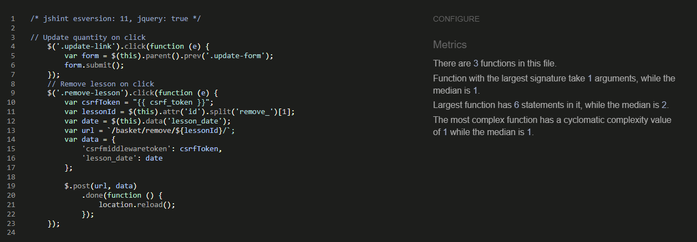 | Pass: No Errors |
| lesson_details.html(postload script) | 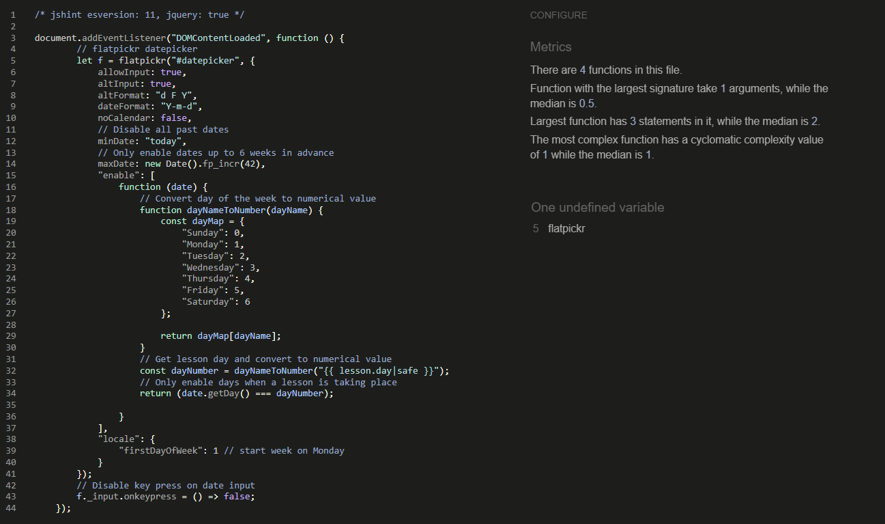 | Undefined Flatpickr variable |
| quantity_input_script.html |  | Pass: No Errors |
| stripe_elements.js |  | Undefined Stripe variable |
| 404.html(postload script) |  | Pass: No Errors |
| 500.html(postload script) |  | Pass: No Errors |

### Python

I have used the recommended [PEP8 CI Python Linter](https://pep8ci.herokuapp.com) to validate all of my Python files.

##### Basket app

<details>
<summary>Click to see the basket app python code validation</summary>

| File | CI URL | Screenshot | Notes |
| --- | --- | --- | --- |
| basket/apps.py | [PEP8 CI](https://pep8ci.herokuapp.com/https://raw.githubusercontent.com/laurabolwell/little-riders-academy/main/basket/apps.py) |  | Pass: No Errors |
| basket/contexts.py | [PEP8 CI](https://pep8ci.herokuapp.com/https://raw.githubusercontent.com/laurabolwell/little-riders-academy/main/basket/contexts.py) |  | Pass: No Errors |
| basket/templatetags/basket_tools.py | [PEP8 CI](https://pep8ci.herokuapp.com/https://raw.githubusercontent.com/laurabolwell/little-riders-academy/main/basket/templatetags/basket_tools.py) |  | Pass: No Errors |
| basket/apps.py | [PEP8 CI](https://pep8ci.herokuapp.com/https://raw.githubusercontent.com/laurabolwell/little-riders-academy/main/basket/urls.py) |  | Pass: No Errors |
| basket/views.py | [PEP8 CI](https://pep8ci.herokuapp.com/https://raw.githubusercontent.com/laurabolwell/little-riders-academy/main/basket/views.py) |  | Pass: No Errors |

</details>

##### Checkout app

<details>
<summary>Click to see the checkout app python code validation</summary>

| File | CI URL | Screenshot | Notes |
| --- | --- | --- | --- |
| checkout/admin.py | [PEP8 CI](https://pep8ci.herokuapp.com/https://raw.githubusercontent.com/laurabolwell/little-riders-academy/main/checkout/admin.py) |  | Pass: No Errors |
| checkout/apps.py | [PEP8 CI](https://pep8ci.herokuapp.com/https://raw.githubusercontent.com/laurabolwell/little-riders-academy/main/checkout/apps.py) |  | Pass: No Errors |
| checkout/forms.py | [PEP8 CI](https://pep8ci.herokuapp.com/https://raw.githubusercontent.com/laurabolwell/little-riders-academy/main/checkout/forms.py) |  | Pass: No Errors |
| checkout/models.py | [PEP8 CI](https://pep8ci.herokuapp.com/https://raw.githubusercontent.com/laurabolwell/little-riders-academy/main/checkout/models.py) |  | Pass: No Errors |
| checkout/signals.py | [PEP8 CI](https://pep8ci.herokuapp.com/https://raw.githubusercontent.com/laurabolwell/little-riders-academy/main/checkout/signals.py) |  | Pass: No Errors |
| checkout/urls.py | [PEP8 CI](https://pep8ci.herokuapp.com/https://raw.githubusercontent.com/laurabolwell/little-riders-academy/main/checkout/urls.py) |  | Pass: No Errors |
| checkout/views.py | [PEP8 CI](https://pep8ci.herokuapp.com/https://raw.githubusercontent.com/laurabolwell/little-riders-academy/main/checkout/views.py) |  | Pass: No Errors |
| checkout/webhook-handler.py | [PEP8 CI](https://pep8ci.herokuapp.com/https://raw.githubusercontent.com/laurabolwell/little-riders-academy/main/checkout/webhook_handler.py) |  | Pass: No Errors |
| checkout/webhooks.py | [PEP8 CI](https://pep8ci.herokuapp.com/https://raw.githubusercontent.com/laurabolwell/little-riders-academy/main/checkout/webhooks.py) |  | Pass: No Errors |

</details>

##### Contact app

<details>
<summary>Click to see the contact app python code validation</summary>

| File | CI URL | Screenshot | Notes |
| --- | --- | --- | --- |
| contact/apps.py | [PEP8 CI](https://pep8ci.herokuapp.com/https://raw.githubusercontent.com/laurabolwell/little-riders-academy/main/contact/apps.py) |  | Pass: No Errors |
| contact/forms.py | [PEP8 CI](https://pep8ci.herokuapp.com/https://raw.githubusercontent.com/laurabolwell/little-riders-academy/main/contact/forms.py) |  | Pass: No Errors |
| contact/models.py | [PEP8 CI](https://pep8ci.herokuapp.com/https://raw.githubusercontent.com/laurabolwell/little-riders-academy/main/contact/models.py) |  | Pass: No Errors |
| contact/urls.py | [PEP8 CI](https://pep8ci.herokuapp.com/https://raw.githubusercontent.com/laurabolwell/little-riders-academy/main/contact/urls.py) |  | Pass: No Errors |
| contact/views.py | [PEP8 CI](https://pep8ci.herokuapp.com/https://raw.githubusercontent.com/laurabolwell/little-riders-academy/main/contact/views.py) |  | Pass: No Errors |

</details>

##### FAQs app

<details>
<summary>Click to see the FAQs app python code validation</summary>

| File | CI URL | Screenshot | Notes |
| --- | --- | --- | --- |
| faqs/admin.py | [PEP8 CI](https://pep8ci.herokuapp.com/https://raw.githubusercontent.com/laurabolwell/little-riders-academy/main/faqs/admin.py) | 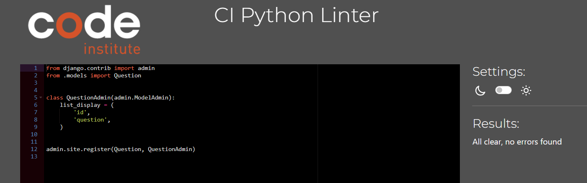 | Pass: No Errors |
| faqs/apps.py | [PEP8 CI](https://pep8ci.herokuapp.com/https://raw.githubusercontent.com/laurabolwell/little-riders-academy/main/faqs/apps.py) |  | Pass: No Errors |
| faqs/forms.py | [PEP8 CI](https://pep8ci.herokuapp.com/https://raw.githubusercontent.com/laurabolwell/little-riders-academy/main/faqs/forms.py) |  | Pass: No Errors |
| faqs/models.py | [PEP8 CI](https://pep8ci.herokuapp.com/https://raw.githubusercontent.com/laurabolwell/little-riders-academy/main/faqs/models.py) |  | Pass: No Errors |
| faqs/urls.py | [PEP8 CI](https://pep8ci.herokuapp.com/https://raw.githubusercontent.com/laurabolwell/little-riders-academy/main/faqs/urls.py) |  | Pass: No Errors |
| faqs/views.py | [PEP8 CI](https://pep8ci.herokuapp.com/https://raw.githubusercontent.com/laurabolwell/little-riders-academy/main/faqs/views.py) |  | Pass: No Errors |

</details>

##### Home app

<details>
<summary>Click to see the home app python code validation</summary>

| File | CI URL | Screenshot | Notes |
| --- | --- | --- | --- |
| home/apps.py | [PEP8 CI](https://pep8ci.herokuapp.com/https://raw.githubusercontent.com/laurabolwell/little-riders-academy/main/home/apps.py) |  | Pass: No Errors |
| home/urls.py | [PEP8 CI](https://pep8ci.herokuapp.com/https://raw.githubusercontent.com/laurabolwell/little-riders-academy/main/home/urls.py) |  | Pass: No Errors |
| home/views.py | [PEP8 CI](https://pep8ci.herokuapp.com/https://raw.githubusercontent.com/laurabolwell/little-riders-academy/main/home/views.py) |  | Pass: No Errors |

</details>

##### Lessons app

<details>
<summary>Click to see the Lessons app python code validation</summary>

| File | CI URL | Screenshot | Notes |
| --- | --- | --- | --- |
| lessons/admin.py | [PEP8 CI](https://pep8ci.herokuapp.com/https://raw.githubusercontent.com/laurabolwell/little-riders-academy/main/lessons/admin.py) |  | Pass: No Errors |
| lessons/apps.py | [PEP8 CI](https://pep8ci.herokuapp.com/https://raw.githubusercontent.com/laurabolwell/little-riders-academy/main/lessons/apps.py) |  | Pass: No Errors |
| lessons/forms.py | [PEP8 CI](https://pep8ci.herokuapp.com/https://raw.githubusercontent.com/laurabolwell/little-riders-academy/main/lessons/forms.py) |  | Pass: No Errors |
| lessons/models.py | [PEP8 CI](https://pep8ci.herokuapp.com/https://raw.githubusercontent.com/laurabolwell/little-riders-academy/main/lessons/models.py) |  | Pass: No Errors |
| lessons/urls.py | [PEP8 CI](https://pep8ci.herokuapp.com/https://raw.githubusercontent.com/laurabolwell/little-riders-academy/main/lessons/urls.py) |  | Pass: No Errors |
| lessons/views.py | [PEP8 CI](https://pep8ci.herokuapp.com/https://raw.githubusercontent.com/laurabolwell/little-riders-academy/main/lessons/views.py) |  | Pass: No Errors |
| lessons/widgets.py | [PEP8 CI](https://pep8ci.herokuapp.com/https://raw.githubusercontent.com/laurabolwell/little-riders-academy/main/lessons/widgets.py) |  | Pass: No Errors |

</details>

##### Little Riders Academy app

<details>
<summary>Click to see the Little Riders Academy app python code validation</summary>

| File | CI URL | Screenshot | Notes |
| --- | --- | --- | --- |
| little_riders_academy/asgi.py | [PEP8 CI](https://pep8ci.herokuapp.com/https://raw.githubusercontent.com/laurabolwell/little-riders-academy/main/little_riders_academy/asgi.py) |  | Pass: No Errors |
| little_riders_academy/settings.py | [PEP8 CI](https://pep8ci.herokuapp.com/https://raw.githubusercontent.com/laurabolwell/little-riders-academy/main/little_riders_academy/settings.py) |  | Pass: No Errors |
| little_riders_academy/urls.py | [PEP8 CI](https://pep8ci.herokuapp.com/https://raw.githubusercontent.com/laurabolwell/little-riders-academy/main/little_riders_academy/urls.py) |  | Pass: No Errors |
| little_riders_academy/views.py | [PEP8 CI](https://pep8ci.herokuapp.com/https://raw.githubusercontent.com/laurabolwell/little-riders-academy/main/little_riders_academy/views.py) |  | Pass: No Errors |
| little_riders_academy/wsgi.py | [PEP8 CI](https://pep8ci.herokuapp.com/https://raw.githubusercontent.com/laurabolwell/little-riders-academy/main/little_riders_academy/wsgi.py) |  | Pass: No Errors |

</details>

##### Profiles app

<details>
<summary>Click to see the Profiles app python code validation</summary>

| File | CI URL | Screenshot | Notes |
| --- | --- | --- | --- |
| profiles/admin.py | [PEP8 CI](https://pep8ci.herokuapp.com/https://raw.githubusercontent.com/laurabolwell/little-riders-academy/main/profiles/admin.py) |  | Pass: No Errors |
| profiles/apps.py | [PEP8 CI](https://pep8ci.herokuapp.com/https://raw.githubusercontent.com/laurabolwell/little-riders-academy/main/profiles/apps.py) |  | Pass: No Errors |
| profiles/forms.py | [PEP8 CI](https://pep8ci.herokuapp.com/https://raw.githubusercontent.com/laurabolwell/little-riders-academy/main/profiles/forms.py) |  | Pass: No Errors |
| profiles/models.py | [PEP8 CI](https://pep8ci.herokuapp.com/https://raw.githubusercontent.com/laurabolwell/little-riders-academy/main/profiles/models.py) |  | Pass: No Errors |
| profiles/urls.py | [PEP8 CI](https://pep8ci.herokuapp.com/https://raw.githubusercontent.com/laurabolwell/little-riders-academy/main/profiles/urls.py) |  | Pass: No Errors |
| profiles/views.py | [PEP8 CI](https://pep8ci.herokuapp.com/https://raw.githubusercontent.com/laurabolwell/little-riders-academy/main/profiles/views.py) |  | Pass: No Errors |

</details>

##### Testimonials app

<details>
<summary>Click to see the Testimonials app python code validation</summary>

| File | CI URL | Screenshot | Notes |
| --- | --- | --- | --- |
| testimonials/admin.py | [PEP8 CI](https://pep8ci.herokuapp.com/https://raw.githubusercontent.com/laurabolwell/little-riders-academy/main/testimonials/admin.py) |  | Pass: No Errors |
| testimonials/apps.py | [PEP8 CI](https://pep8ci.herokuapp.com/https://raw.githubusercontent.com/laurabolwell/little-riders-academy/main/testimonials/apps.py) |  | Pass: No Errors |
| testimonials/forms.py | [PEP8 CI](https://pep8ci.herokuapp.com/https://raw.githubusercontent.com/laurabolwell/little-riders-academy/main/testimonials/forms.py) |  | Pass: No Errors |
| testimonials/models.py | [PEP8 CI](https://pep8ci.herokuapp.com/https://raw.githubusercontent.com/laurabolwell/little-riders-academy/main/testimonials/models.py) |  | Pass: No Errors |
| testimonials/urls.py | [PEP8 CI](https://pep8ci.herokuapp.com/https://raw.githubusercontent.com/laurabolwell/little-riders-academy/main/testimonials/urls.py) |  | Pass: No Errors |
| testimonials/views.py | [PEP8 CI](https://pep8ci.herokuapp.com/https://raw.githubusercontent.com/laurabolwell/little-riders-academy/main/testimonials/views.py) |  | Pass: No Errors |

</details>

##### Root Level files

<details>
<summary>Click to see the root level files python code validation</summary>

| File | CI URL | Screenshot | Notes |
| --- | --- | --- | --- |
| custom_storages.py | [PEP8 CI](https://pep8ci.herokuapp.com/https://raw.githubusercontent.com/laurabolwell/little-riders-academy/main/custom_storages.py) |  | Pass: No Errors |
| custom_storages.py | [PEP8 CI](https://pep8ci.herokuapp.com/https://raw.githubusercontent.com/laurabolwell/little-riders-academy/main/manage.py) |  | Pass: No Errors |

</details>


## Browser Compatibility


I've tested my deployed project on multiple browsers to check for compatibility issues.

| Browser | Home | Lessons | Lesson Details | Checkout | Notes |
| --- | --- | --- | --- | --- | --- |
| Chrome |  | 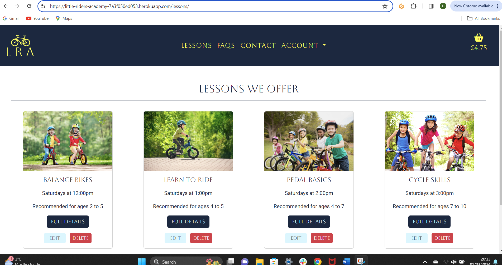 |  | 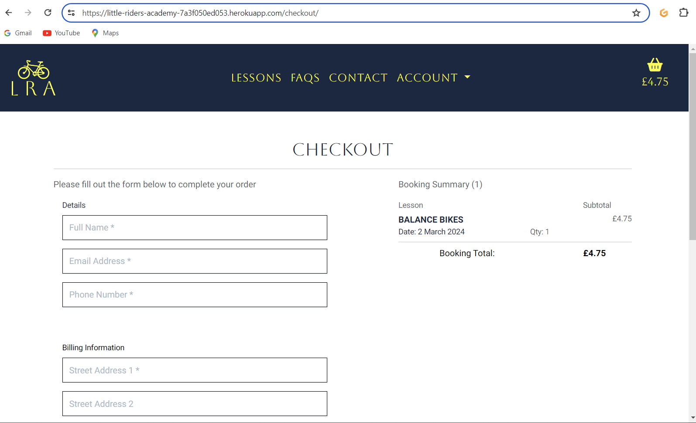 | Works as expected |
| Firefox |  |  |  |  | Works as expected |
| Edge |  |  |  |  | Works as expected |
| Brave |  |  |  |  | Works as expected |
| Opera |  |  |  |  | Works as expected |

## Responsiveness

I've considered different size devices when designing my website and tested regularly throughout the development process to ensure full responsiveness. I've tested my deployed project on multiple devices to check for responsiveness issues.

| Device | Mobile | Tablet | Desktop | Notes |
| --- | --- | --- | --- | --- |
| Homepage |  |  |  | Works as expected |
| Lessons |  |  |  | Works as expected |
| Lesson Details |  |  |  | Works as expected |
| Basket |  |  |  | Works as expected |
| Checkout |  |  |  | Works as expected |
| Checkout Success | 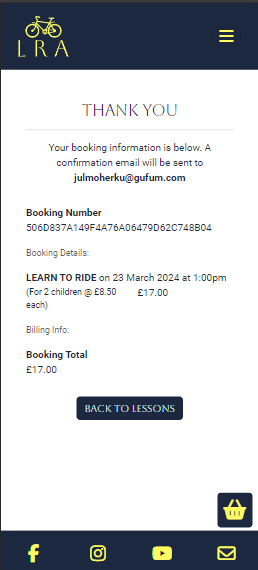 |  |  | Works as expected |
| Contact |  |  |  | Works as expected |
| FAQs |  |  |  | Works as expected |
| Profile |  |  |  | Works as expected |
| Testimonial |  | 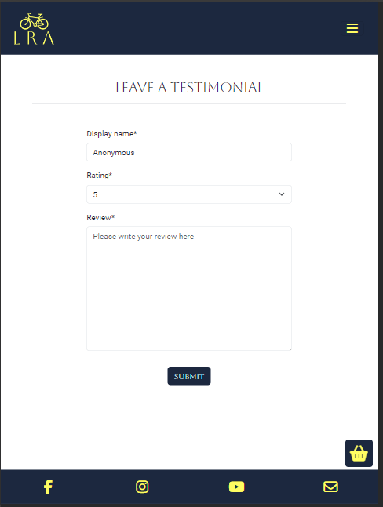 |  | Works as expected |


## Lighthouse Audit

I've tested my deployed project using the Lighthouse Audit tool to check for any major issues. There are some performance issues across the site due to the javascript librabries being loaded.

| Page | Mobile | Desktop |
| --- | --- | --- |
| Home |  | 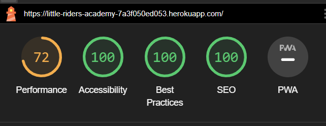 |
| Lessons |  |  |
| Lesson Details |  |  |
| Add Lesson |  |  |
| Edit Lesson |  |  |
| Basket |  |  |
| Checkout |  |  |
| Checkout Success |  |  |
| Contact |  |  |
| View Queries |  |  |
| Add Testimonial |  |  |
| Profile |  |  |
| FAQs |  |  | Some minor warnings |
| Add Question |  |  |
| Edit Question |  |  |


## Defensive Programming

Defensive programming was manually tested with the below user acceptance testing:

| | Expectation | Test | Result | Fix | Screenshot |
| --- | --- | --- | --- | --- | --- |
| Unauthenticated users should not be able to access pages requiring authentication and standard users should not be able to access superuser pages. | Lesson add page only accessible to superusers | Tried to access 'add_lesson' without logging in | The feature behaved as expected and redirected to login page | Test concluded and passed | 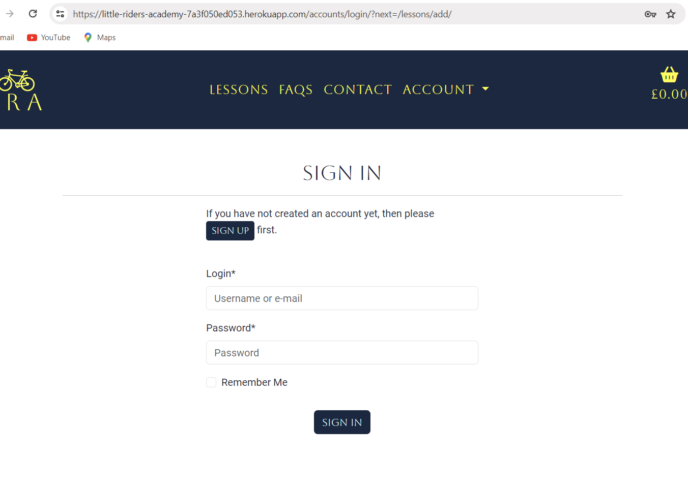 |
| | Lesson add page only accessible to superusers | Tried to access 'add_lesson' by logging in as a regular user | The feature behaved as expected and redirected to lessons page with an error message | Test concluded and passed |  |
| | Lesson edit page only accessible to superusers | Tried to access 'edit_lesson' without logging in | The feature behaved as expected and redirected to login page | Test concluded and passed |  |
| | Lesson edit page only accessible to superusers | Tried to access 'edit_lesson' by logging in as a regular user | The feature behaved as expected and redirected to lessons page with an error message | Test concluded and passed | 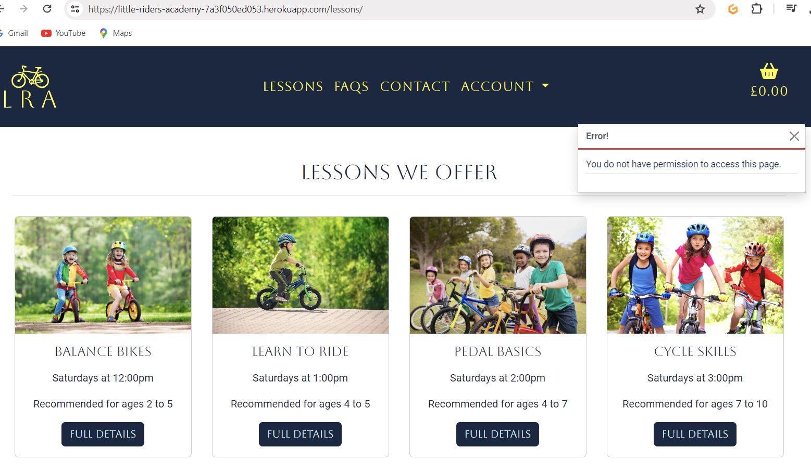 |
| | Lesson delete page only accessible to superusers | Tried to access 'delete_lesson' without logging in | The feature behaved as expected and redirected to login page | Test concluded and passed |  |
| | Lesson delete page only accessible to superusers | Tried to access 'delete_lesson' by logging in as a regular user | The feature behaved as expected and redirected to lessons page with an error message | Test concluded and passed |  |
| | FAQ add page only accessible to superusers | Tried to access 'add_question' without logging in | The feature behaved as expected and redirected to login page | Test concluded and passed |  |
| | FAQ add page only accessible to superusers | Tried to access 'add_question' by logging in as a regular user | The feature behaved as expected and redirected to faqs page with an error message | Test concluded and passed |  |
| | FAQ edit page only accessible to superusers | Tried to access 'edit_question' without logging in | The feature behaved as expected and redirected to login page | Test concluded and passed |  |
| | FAQ edit page only accessible to superusers | Tried to access 'edit_question' by logging in as a regular user | The feature behaved as expected and redirected faqs page with an error message | Test concluded and passed |  |
| | FAQ delete page only accessible to superusers | Tried to access 'delete_question' without logging in | The feature behaved as expected and redirected to login page | Test concluded and passed |  |
| | FAQ delete page only accessible to superusers | Tried to access 'delete_question' by logging in as a regular user | The feature behaved as expected and redirected faqs page with an error message | Test concluded and passed |  |
| | Leave testimonial page only accessible to logged in users | Tried to access 'leave_testimonial' without logging in | The feature behaved as expected and redirected to login page with an error message | Test concluded and passed |  |
| | Profile page only accessible to logged in users | Tried to access 'profile' without logging in | The feature behaved as expected and redirected to login page | Test concluded and passed |  |
| Users cannot submit empty forms | Contact form cannot be submitted with empty required fields | Tested the page by trying to submit with a blank name | The form behaved as expected, and flagged that a name was needed | Test concluded and passed |  |
| | Contact form cannot be submitted with empty required fields | Tested the page by trying to submit with a blank email | The form behaved as expected, and flagged that an email was needed | Test concluded and passed |  |
| | Contact form cannot be submitted with empty required fields | Tested the page by trying to submit with a blank message | The form behaved as expected, and flagged that a message was needed | Test concluded and passed |  |
| | Add to basket form cannot be submitted with empty date field | Tested the page by trying to submit with a blank date | The form behaved as expected, and flagged that a date was needed | Test concluded and passed |  |
| | Add to basket form quantity input buttons will not allow to go below 0 | Tested the page by trying to decrease the quantity below 1 | The form behaved as expected, and the button disabled at 1 | Test concluded and passed |  |
| | Add to basket form quantity input buttons will not allow to go above the max class_size | Tested the page by trying to increase the quantity above the class_size | The form behaved as expected, and the button disabled at the max class size | Test concluded and passed |  |
| | Checkout form quantity will not allow submission until all required fields are validated | Tested the page by trying to submit completely empty and then add one field at a time followed by trying to submit. | The form behaved as expected, and the form could only be submitted when all required fields were complete and validated | Test concluded and passed |  |
| | FAQ add question form will not allow submission with blank question field | Tested the page by trying to submit with blank question field| The form behaved as expected, and flagged that a question was needed | Test concluded and passed | 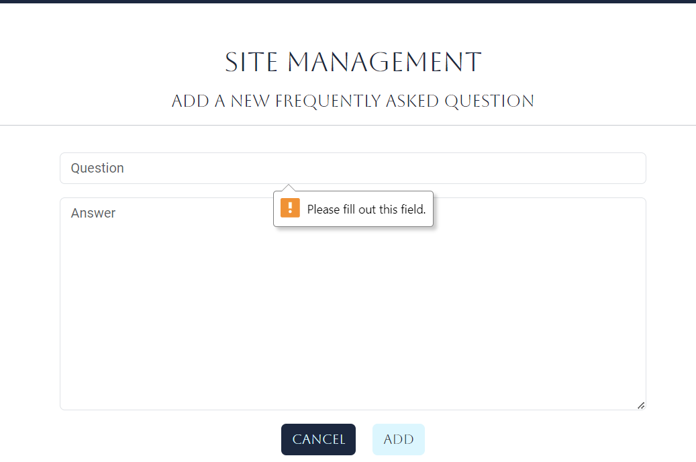 |
| | FAQ add question form will not allow submission with blank answer field | Tested the page by trying to submit with blank answer field| The form behaved as expected, and flagged that an answer was needed | Test concluded and passed |  |
| | Add Lesson form will not allow submission with blank name field | Tested the page by trying to submit with blank name field | The form behaved as expected, and flagged that a name was needed | Test concluded and passed |  |
| | Add Lesson form will not allow submission with blank name description field | Tested the page by trying to submit with blank description field | The form behaved as expected, and flagged that a description was needed | Test concluded and passed |  |
| | Add Lesson form will not allow submission with blank image field | Tested the page by trying to submit with blank image field | The form behaved as expected, and flagged that an image was needed | Test concluded and passed | 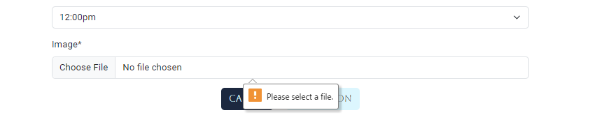 |
| | Leave testimonial form will not allow submission with blank review field | Tested the page by trying to submit with blank review field | The form behaved as expected, and flagged that a review was needed | Test concluded and passed |  |
| Email addresses must be valid | Checkout form will not allow submission with an incorrect email address | Tested the page by trying to submit with incorrect format email addresses | The form behaved as expected, and the complete_checkout button disables when the email address is incorrect (it must match Django's GitHub code for "domain_regex") | Test concluded and passed |  |
| Data cannot be accidentally modified or deleted | Cannot edit lesson data without checking with user | Tested the page by trying to edit lesson details | The form behaved as expected, and an edit_lesson modal appeared to ask if I definitely wanted to edit the lesson. | Test concluded and passed |  |
| | Cannot delete lesson data without checking with user | Tested the page by trying to delete a lesson | The page behaved as expected, and a delete_lesson modal appeared to ask if I definitely wanted to delete the lesson. This happens on both the delete button on the main lessons page and the delete button on the lesson_details page. | Test concluded and passed |  |
| Data cannot be accidentally modified or deleted | Cannot edit a question without checking with user | Tested the page by trying to edit a question | The form behaved as expected, and an edit_question modal appeared to ask if I definitely wanted to edit the question | Test concluded and passed |  |
| | Cannot delete a question without checking with user | Tested the page by trying to delete a question | The page behaved as expected, and a delete_question modal appeared to ask if I definitely wanted to delete the lesson. | Test concluded and passed |  |
| All links and buttons work as expected | All links and buttons on all pages have been extensively tested and all work as intended | | Pass | | |

## User Story Testing

| User Story | Screenshot | |
| --- | --- | --- |
| - As a new site user, I would like to find out what the business is about , so that I can see if it would be suitable for me to use. |  | |
| - As a new site user, I would like to view a list of the lessons available, so that I can see if any of them are suitable for my child. | 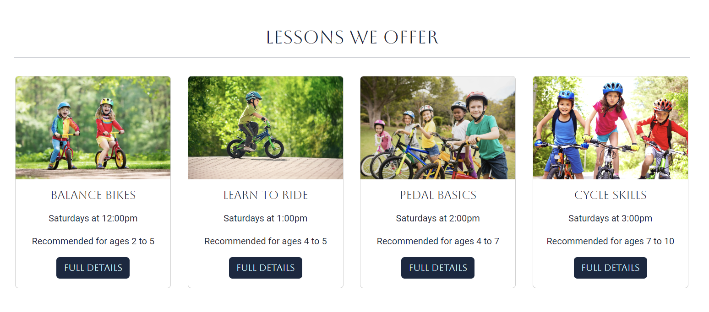 | |
| - As a new site user, I would like to view full details of each type of lesson, so that I view lesson days/times, price and full details so see if the lesson is suitable for my child. |  | |
| - As a new site user, I would like to see what other customers think of the lessons, so that I can make an informed decision as to whether I want to use them. | 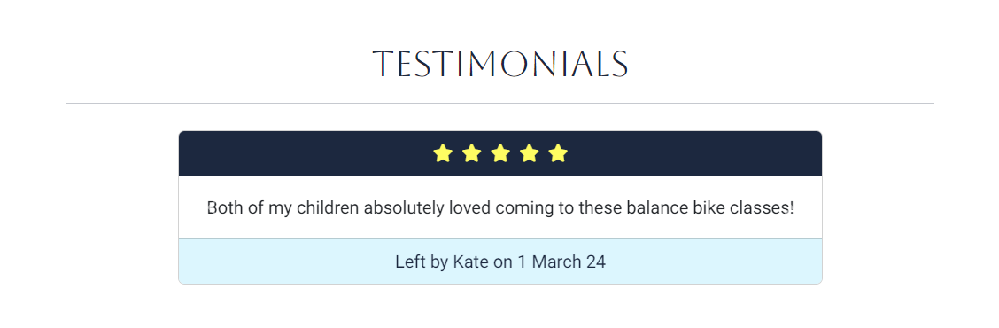 | |
| - As a new site user, I would like to have basic questions about the lessons answered, so that I know all necessary information to be able to bring my child to them. |  | |
| - As a new site user, I would like to contact the business owner, so that I can ask any additional questions I may have. |  |  |
| - As a new/returning site user, I would like to easily select the date and quantity for lessons I want to book, so that I can book lessons on the correct date and for the correct number of children. |  |   |
| - As a new/returning site user, I would like to easily add lessons to my basket, so that I can book and pay for more than one at a time. | 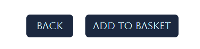 | |
| - As a new/returning site user, I would like to see a brief overview of my basket once I have added lessons to it, so that I can book and pay for more than one at a time. | 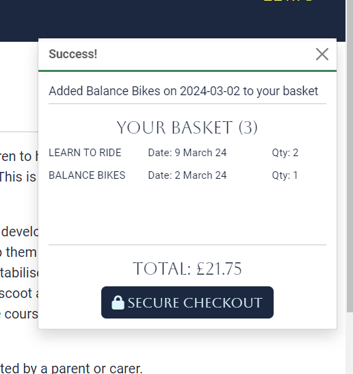 | |
| - As a new/returning site user, I would like to view the lessons in my basket, so I can check I am happy with all the details before booking/paying. |  | |
| - As a new/returning site user, I would like to easily edit the lessons in my basket, so that I can fix any errors/change my mind without having to go back and start again. |  | |
| - As a new/returning site user, I would like to easily remove lessons from my basket, so that I can correct any error or change my mind. |  | |
| - As a new/returning site user, I would like to book and pay for a lesson for my child, so that my child can attend the lesson. | 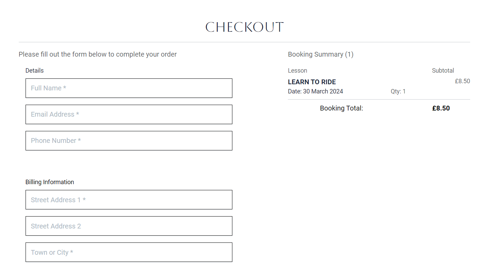 | |
| - As a new/returning site user, I would like to easily enter my payment information, so that I can book the lesson. |  | |
| - As a new/returning site user, I would like to feel my payment information is safe and secure, so that I can confidently provide the information needed to make a purchase. |  | |
| - As a new/returning site user, I would like to view a booking confirmation after checkout, so that I know that the booking has been successful. | 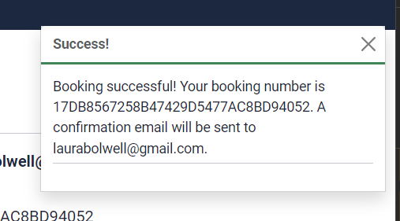 | 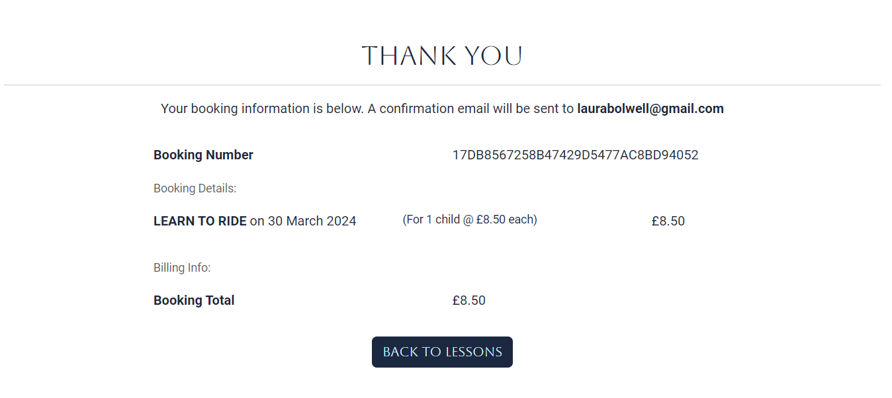 |
| - As a new/returning site user, I would like to receive an email confirmation after checking out, so that I keep the confirmation for my records. |  | |
| - As a returning site user, I would like to easily create an account, so that I can checkout faster in the future. |  | |
| - As a returning site user, I would like to easily login or logout, so that I can access my personal account information. |  |  |
| - As a returning site user, I would like to easily view my bookings at any time, so that I can see how many lessons my child has attended in the past and any which are coming up in the future. |  | |
| - As a returning site user, I would like to have a personalised user profile, so that I can save my details and checkout faster in future. |  | |
| - As a returning site user, I would like to leave a testimonial, so that I can let other users know what I think of the lessons. | 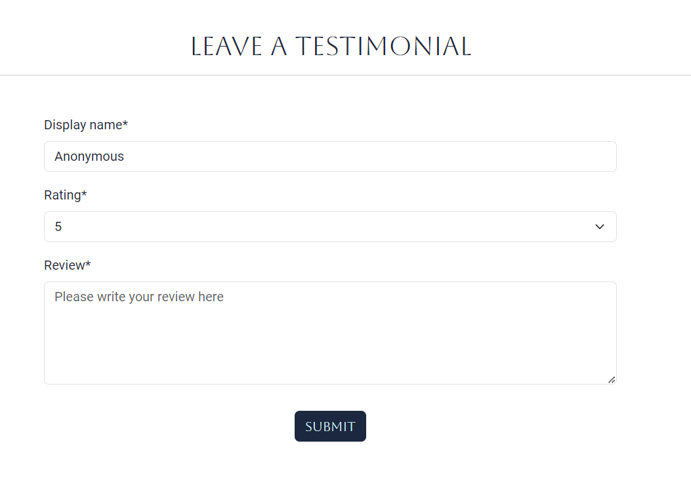 | |
| - As a site administrator, I should be able to add a new lesson to the site, so that I can offer more types of lessons to customers. |  | |
| - As a site administrator, I should be able to edit a lesson, so that I can change the details of the classes. |  |  |
| - As a site administrator, I should be able to delete a lesson, so that I can stop offering lessons which are unable to run. | 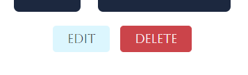 |  |
| - As a site administrator, I should be asked to confirm whether I want to delete/edit a lesson, so that I can't accidentally perform these actions. |  |  |
| - As a site administrator, I should be able to view customer messages that have been sent through the contact app, so that I can answer customer queries. | 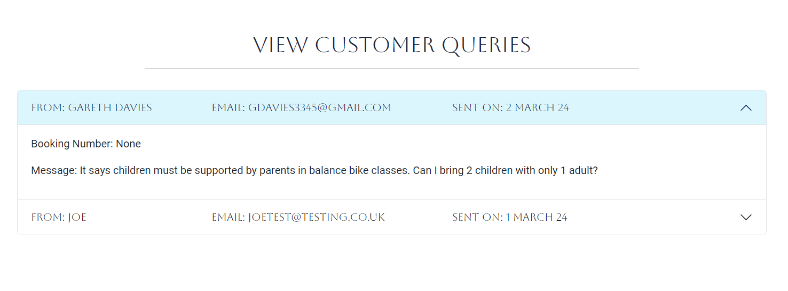 | |
| - As a site administrator, I should be able to add a FAQ, so that I can reduce the amount of contact emails I am receiving. |  | |
| - As a site administrator, I should be able to edit a FAQ, so that I can reduce the amount of contact emails I am receiving. |  |  |
| - As a site administrator, I should be asked to confirm whether I want to delete/edit an FAQ, so that I can't accidentally perform these actions. |  |  |
| - As a site administrator, I should be able to see messages to confirm whether all these actions have been successful. |  |  |

## Automated Testing

I have conducted a series of automated tests on my application.

I fully acknowledge and understand that, in a real-world scenario, an extensive set of additional tests would be more comprehensive.

### JavaScript (Jest Testing)

I have not carried out any jest testing on this project due to the only javascript file in the project being the stripe_elements.js file which consists of code taken from the stripe documentation. All other scripts are written in the bottom of html files and rely heavily on template variables. I have tried to move the scripts to external js files to be able to test them but I cannot confidently pass through the loops of template variables to be used correctly, and so I have decided not to carry out jest testing so as not to risk losing any of the javascript functionality of the site.

If I had any other javascript files, these are the steps I would carry out to test them:

In order to work with Jest, first initialize NPM.

- `npm init`
- Hit `enter` for all options, except for **test command:**, just type `jest`.

Add Jest to a list called **Dev Dependencies** in a dev environment:

- `npm install --save-dev jest`

**IMPORTANT**: Initial configurations

When creating test files, the name of the file needs to be `file-name.test.js` in order for Jest to properly work.

Without the following, Jest won't properly run the tests:

- `npm install -D jest-environment-jsdom`

Due to a change in Jest's default configuration, you'll need to add the following code to the top of the `.test.js` file:

```js
/**
 * @jest-environment jsdom
 */

const { test, expect } = require("@jest/globals");
const { function1, function2, function3, etc. } = require("../script-name");

beforeAll(() => {
    let fs = require("fs");
    let fileContents = fs.readFileSync("index.html", "utf-8");
    document.open();
    document.write(fileContents);
    document.close();
});
```

Remember to adjust the `fs.readFileSync()` to the specific file you'd like you test.
The example above is testing the `index.html` file.

Finally, at the bottom of the script file where your primary scripts are written, include the following at the bottom of the file.
Make sure to include the name of all of your functions that are being tested in the `.test.js` file.

```js
if (typeof module !== "undefined") module.exports = {
    function1, function2, function3, etc.
};
```

Now that these steps have been undertaken, further tests can be written, and be expected to fail initially.
Write JS code that can get the tests to pass as part of the Red-Green refactor process.

Once ready, to run the tests, use this command:

- `npm test`

**NOTE**: To obtain a coverage report, use the following command:

- `npm test --coverage`

Below are the results from the tests that I've written for this application:

| Test Suites | Tests | Screenshot |
| --- | --- | --- |
| 1 passed | 16 passed |  |
| x | x | repeat for all remaining tests |


### Python (Unit Testing)

I have used Django's built-in unit testing framework to test the application functionality.

In order to run the tests, I ran the following command in the terminal each time:

`python3 manage.py test name-of-app `

To create the coverage report, I would then run the following commands:

`coverage run --source=name-of-app manage.py test`

`coverage report`

To see the HTML version of the reports, and find out whether some pieces of code were missing, I ran the following commands:

`coverage html`

`python3 -m http.server`

Below are the results from the various apps on my application that I've tested:

| App | Coverage | Test Results | Coverage |
| --- | --- | --- | --- |
| FAQs | 100% | 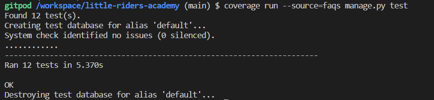 |  |
| Lessons | 94% |  |  |
| Contact | 98% |  |  |


## Bugs

Most minor issues and bugs were rectified quickly during the development process. I used github issues to track any issues which I found more difficult to solve. Previously closed/fixed bugs can be tracked [here](https://github.com/laurabolwell/little-riders-academy/issues).

| Bug | Status |
| --- | --- |
| [Error when form is incorrect (but payment still taken and booking created) ](https://github.com/laurabolwell/little-riders-academy/issues/1) | Closed |
| [Bookings being created twice if postcode isn't an exact match](https://github.com/laurabolwell/little-riders-academy/issues/2) | Closed |
| [Required attribute on datapicker not working](https://github.com/laurabolwell/little-riders-academy/issues/3) | Closed |
| [Basket quantity update and delete buttons not working since updating date format](https://github.com/laurabolwell/little-riders-academy/issues/4) | Closed |

## Unfixed Bugs

- On the checkout page, the fix I have implemented to fix issue one works except when profile information is preloaded in the form. The fix works by disabling the submit button and listening for changes to the email field and re-enables it when the email passes the Django regex validation criteria. When the form is preloaded, there is no change to the email field so the buttom will be disabled even if the email address is valid. 

    

Other than this, there are no remaining bugs that I am aware of.

Return back to the [README.md](README.md) file.