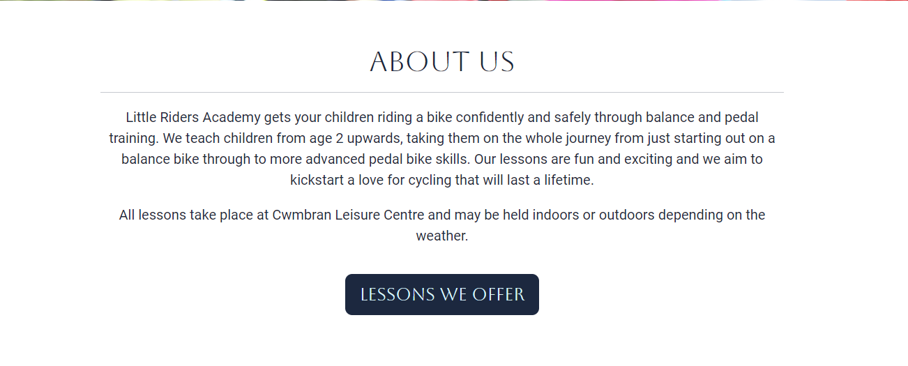
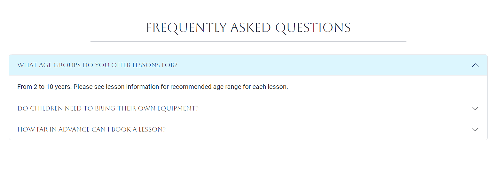
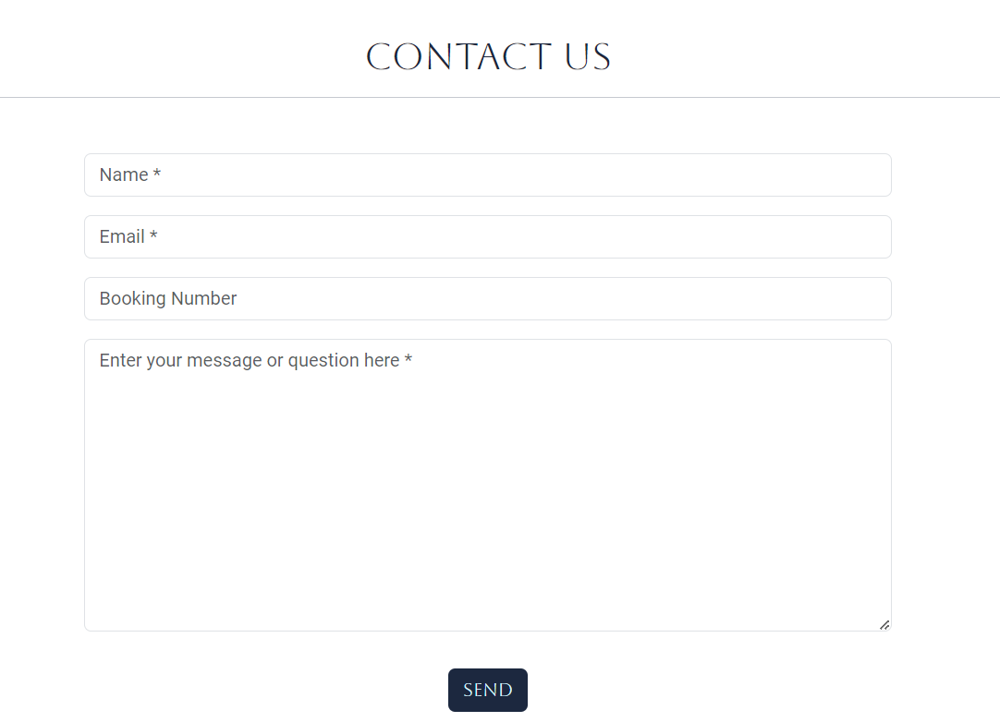
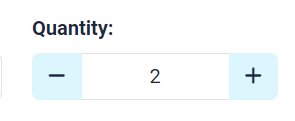
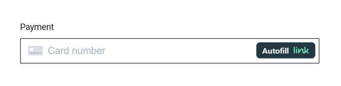
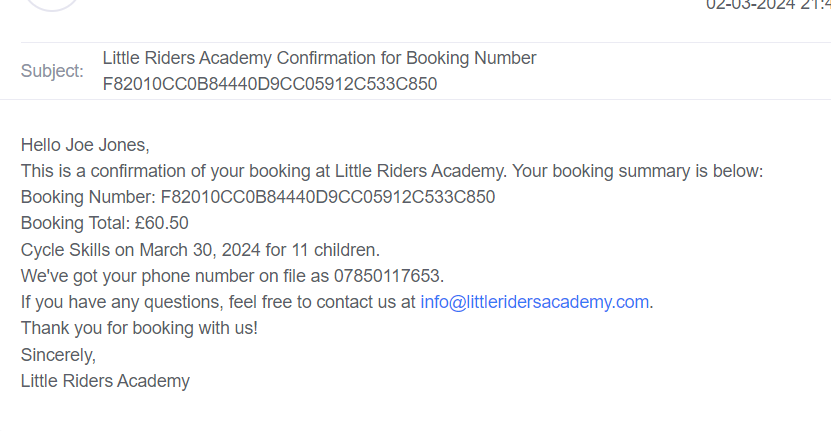
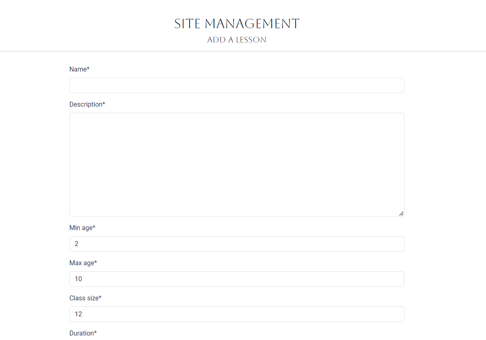
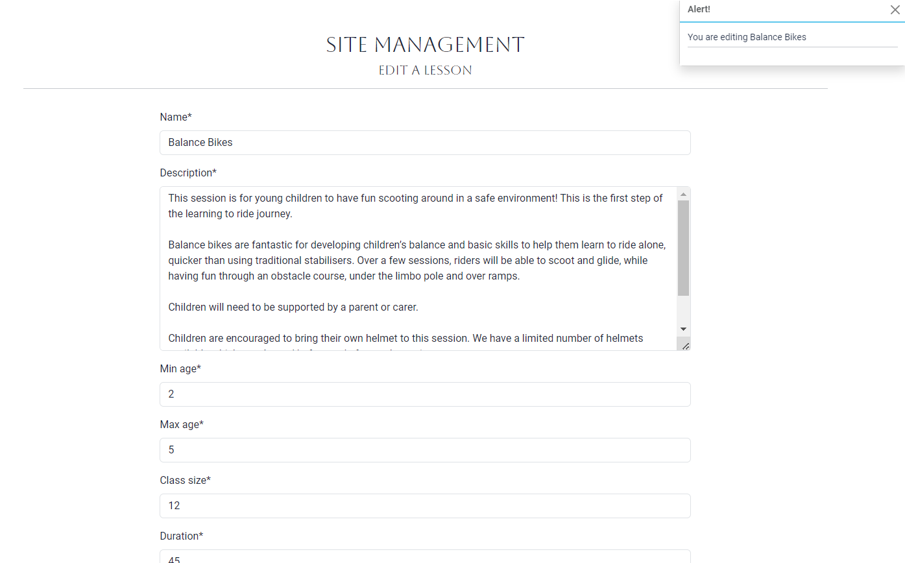
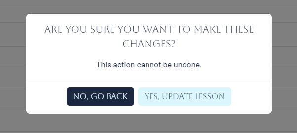

# Testing

Return back to the [README.md](README.md) file.

## Code Validation

### HTML

I have used the recommended [HTML W3C Validator](https://validator.w3.org) to validate all of my HTML files.

| Page | W3C URL | Screenshot | Notes |
| --- | --- | --- | --- |
| Home | [W3C](https://validator.w3.org/nu/?doc=https%3A%2F%2Flaurabolwell.github.io%2Flittle-riders-academy%2Findex.html) |  | Section lacks header h2-h6 warning |
| Contact | [W3C](https://validator.w3.org/nu/?doc=https%3A%2F%2Flaurabolwell.github.io%2Flittle-riders-academy%2Fcontact.html) |  | obsolete iframe warnings |
| Quiz | [W3C](https://validator.w3.org/nu/?doc=https%3A%2F%2Flaurabolwell.github.io%2Flittle-riders-academy%2Fquiz.html) |  | Pass: No Errors |
| Add Blog | n/a |  | Duplicate IDs found, and fixed |
| Checkout | n/a |  | Pass: No Errors |
| x | x | x | repeat for all remaining HTML files |

### CSS

I have used the recommended [CSS Jigsaw Validator](https://jigsaw.w3.org/css-validator) to validate all of my CSS files.

| File | Jigsaw URL | Screenshot | Notes |
| --- | --- | --- | --- |
| base.css (live site validation) | [Jigsaw](https://jigsaw.w3.org/css-validator/validator?uri=https%3A%2F%2Flittle-riders-academy-7a3f050ed053.herokuapp.com%2F&profile=css3svg&usermedium=all&warning=1&vextwarning=&lang=en) |  | Pass: All errors shown are from the imported Bootstrap and Flatpickr libraries |
| base.css (direct input validation) | n/a |  | Pass: No Errors |
| checkout.css (direct input validation) | n/a |  | Pass: No Errors |

### JavaScript

I have used the recommended [JShint Validator](https://jshint.com) to validate all of my JS files.

| File | Screenshot | Notes |
| --- | --- | --- |
| base.html(postload script) |  | Undefined and unused variables from Bootstrap |
| index.html(postload script) |  | Pass: No Errors |
| basket.html(postload script) |  | Pass: No Errors |
| lesson_details.html(postload script) |  | Undefined Flatpickr variable |
| quantity_input_script.html |  | Pass: No Errors |
| stripe_elements.js |  | Undefined Stripe variable |
| 404.html(postload script) |  | Pass: No Errors |
| 500.html(postload script) |  | Pass: No Errors |

### Python

I have used the recommended [PEP8 CI Python Linter](https://pep8ci.herokuapp.com) to validate all of my Python files.

##### Basket app

<details>
<summary>Click to see the basket app python code validation</summary>

| File | CI URL | Screenshot | Notes |
| --- | --- | --- | --- |
| basket/apps.py | [PEP8 CI](https://pep8ci.herokuapp.com/https://raw.githubusercontent.com/laurabolwell/little-riders-academy/main/basket/apps.py) |  | Pass: No Errors |
| basket/contexts.py | [PEP8 CI](https://pep8ci.herokuapp.com/https://raw.githubusercontent.com/laurabolwell/little-riders-academy/main/basket/contexts.py) |  | Pass: No Errors |
| basket/templatetags/basket_tools.py | [PEP8 CI](https://pep8ci.herokuapp.com/https://raw.githubusercontent.com/laurabolwell/little-riders-academy/main/basket/templatetags/basket_tools.py) |  | Pass: No Errors |
| basket/apps.py | [PEP8 CI](https://pep8ci.herokuapp.com/https://raw.githubusercontent.com/laurabolwell/little-riders-academy/main/basket/urls.py) |  | Pass: No Errors |
| basket/views.py | [PEP8 CI](https://pep8ci.herokuapp.com/https://raw.githubusercontent.com/laurabolwell/little-riders-academy/main/basket/views.py) |  | Pass: No Errors |

</details>

##### Checkout app

<details>
<summary>Click to see the checkout app python code validation</summary>

| File | CI URL | Screenshot | Notes |
| --- | --- | --- | --- |
| checkout/admin.py | [PEP8 CI](https://pep8ci.herokuapp.com/https://raw.githubusercontent.com/laurabolwell/little-riders-academy/main/checkout/admin.py) |  | Pass: No Errors |
| checkout/apps.py | [PEP8 CI](https://pep8ci.herokuapp.com/https://raw.githubusercontent.com/laurabolwell/little-riders-academy/main/checkout/apps.py) |  | Pass: No Errors |
| checkout/forms.py | [PEP8 CI](https://pep8ci.herokuapp.com/https://raw.githubusercontent.com/laurabolwell/little-riders-academy/main/checkout/forms.py) |  | Pass: No Errors |
| checkout/models.py | [PEP8 CI](https://pep8ci.herokuapp.com/https://raw.githubusercontent.com/laurabolwell/little-riders-academy/main/checkout/models.py) |  | Pass: No Errors |
| checkout/signals.py | [PEP8 CI](https://pep8ci.herokuapp.com/https://raw.githubusercontent.com/laurabolwell/little-riders-academy/main/checkout/signals.py) |  | Pass: No Errors |
| checkout/urls.py | [PEP8 CI](https://pep8ci.herokuapp.com/https://raw.githubusercontent.com/laurabolwell/little-riders-academy/main/checkout/urls.py) |  | Pass: No Errors |
| checkout/views.py | [PEP8 CI](https://pep8ci.herokuapp.com/https://raw.githubusercontent.com/laurabolwell/little-riders-academy/main/checkout/views.py) |  | Pass: No Errors |
| checkout/webhook-handler.py | [PEP8 CI](https://pep8ci.herokuapp.com/https://raw.githubusercontent.com/laurabolwell/little-riders-academy/main/checkout/webhook_handler.py) |  | Pass: No Errors |
| checkout/webhooks.py | [PEP8 CI](https://pep8ci.herokuapp.com/https://raw.githubusercontent.com/laurabolwell/little-riders-academy/main/checkout/webhooks.py) |  | Pass: No Errors |

</details>

##### Contact app

<details>
<summary>Click to see the contact app python code validation</summary>

| File | CI URL | Screenshot | Notes |
| --- | --- | --- | --- |
| contact/apps.py | [PEP8 CI](https://pep8ci.herokuapp.com/https://raw.githubusercontent.com/laurabolwell/little-riders-academy/main/contact/apps.py) |  | Pass: No Errors |
| contact/forms.py | [PEP8 CI](https://pep8ci.herokuapp.com/https://raw.githubusercontent.com/laurabolwell/little-riders-academy/main/contact/forms.py) |  | Pass: No Errors |
| contact/models.py | [PEP8 CI](https://pep8ci.herokuapp.com/https://raw.githubusercontent.com/laurabolwell/little-riders-academy/main/contact/models.py) |  | Pass: No Errors |
| contact/urls.py | [PEP8 CI](https://pep8ci.herokuapp.com/https://raw.githubusercontent.com/laurabolwell/little-riders-academy/main/contact/urls.py) |  | Pass: No Errors |
| contact/views.py | [PEP8 CI](https://pep8ci.herokuapp.com/https://raw.githubusercontent.com/laurabolwell/little-riders-academy/main/contact/views.py) |  | Pass: No Errors |

</details>

##### FAQs app

<details>
<summary>Click to see the FAQs app python code validation</summary>

| File | CI URL | Screenshot | Notes |
| --- | --- | --- | --- |
| faqs/admin.py | [PEP8 CI](https://pep8ci.herokuapp.com/https://raw.githubusercontent.com/laurabolwell/little-riders-academy/main/faqs/admin.py) |  | Pass: No Errors |
| faqs/apps.py | [PEP8 CI](https://pep8ci.herokuapp.com/https://raw.githubusercontent.com/laurabolwell/little-riders-academy/main/faqs/apps.py) |  | Pass: No Errors |
| faqs/forms.py | [PEP8 CI](https://pep8ci.herokuapp.com/https://raw.githubusercontent.com/laurabolwell/little-riders-academy/main/faqs/forms.py) |  | Pass: No Errors |
| faqs/models.py | [PEP8 CI](https://pep8ci.herokuapp.com/https://raw.githubusercontent.com/laurabolwell/little-riders-academy/main/faqs/models.py) |  | Pass: No Errors |
| faqs/urls.py | [PEP8 CI](https://pep8ci.herokuapp.com/https://raw.githubusercontent.com/laurabolwell/little-riders-academy/main/faqs/urls.py) |  | Pass: No Errors |
| faqs/views.py | [PEP8 CI](https://pep8ci.herokuapp.com/https://raw.githubusercontent.com/laurabolwell/little-riders-academy/main/faqs/views.py) |  | Pass: No Errors |

</details>

##### Home app

<details>
<summary>Click to see the home app python code validation</summary>

| File | CI URL | Screenshot | Notes |
| --- | --- | --- | --- |
| home/apps.py | [PEP8 CI](https://pep8ci.herokuapp.com/https://raw.githubusercontent.com/laurabolwell/little-riders-academy/main/home/apps.py) |  | Pass: No Errors |
| home/urls.py | [PEP8 CI](https://pep8ci.herokuapp.com/https://raw.githubusercontent.com/laurabolwell/little-riders-academy/main/home/urls.py) |  | Pass: No Errors |
| home/views.py | [PEP8 CI](https://pep8ci.herokuapp.com/https://raw.githubusercontent.com/laurabolwell/little-riders-academy/main/home/views.py) |  | Pass: No Errors |

</details>

##### Lessons app

<details>
<summary>Click to see the Lessons app python code validation</summary>

| File | CI URL | Screenshot | Notes |
| --- | --- | --- | --- |
| lessons/admin.py | [PEP8 CI](https://pep8ci.herokuapp.com/https://raw.githubusercontent.com/laurabolwell/little-riders-academy/main/lessons/admin.py) |  | Pass: No Errors |
| lessons/apps.py | [PEP8 CI](https://pep8ci.herokuapp.com/https://raw.githubusercontent.com/laurabolwell/little-riders-academy/main/lessons/apps.py) |  | Pass: No Errors |
| lessons/forms.py | [PEP8 CI](https://pep8ci.herokuapp.com/https://raw.githubusercontent.com/laurabolwell/little-riders-academy/main/lessons/forms.py) |  | Pass: No Errors |
| lessons/models.py | [PEP8 CI](https://pep8ci.herokuapp.com/https://raw.githubusercontent.com/laurabolwell/little-riders-academy/main/lessons/models.py) |  | Pass: No Errors |
| lessons/urls.py | [PEP8 CI](https://pep8ci.herokuapp.com/https://raw.githubusercontent.com/laurabolwell/little-riders-academy/main/lessons/urls.py) |  | Pass: No Errors |
| lessons/views.py | [PEP8 CI](https://pep8ci.herokuapp.com/https://raw.githubusercontent.com/laurabolwell/little-riders-academy/main/lessons/views.py) |  | Pass: No Errors |
| lessons/widgets.py | [PEP8 CI](https://pep8ci.herokuapp.com/https://raw.githubusercontent.com/laurabolwell/little-riders-academy/main/lessons/widgets.py) |  | Pass: No Errors |

</details>

##### Little Riders Academy app

<details>
<summary>Click to see the Little Riders Academy app python code validation</summary>

| File | CI URL | Screenshot | Notes |
| --- | --- | --- | --- |
| little_riders_academy/asgi.py | [PEP8 CI](https://pep8ci.herokuapp.com/https://raw.githubusercontent.com/laurabolwell/little-riders-academy/main/little_riders_academy/asgi.py) |  | Pass: No Errors |
| little_riders_academy/settings.py | [PEP8 CI](https://pep8ci.herokuapp.com/https://raw.githubusercontent.com/laurabolwell/little-riders-academy/main/little_riders_academy/settings.py) |  | Pass: No Errors |
| little_riders_academy/urls.py | [PEP8 CI](https://pep8ci.herokuapp.com/https://raw.githubusercontent.com/laurabolwell/little-riders-academy/main/little_riders_academy/urls.py) |  | Pass: No Errors |
| little_riders_academy/views.py | [PEP8 CI](https://pep8ci.herokuapp.com/https://raw.githubusercontent.com/laurabolwell/little-riders-academy/main/little_riders_academy/views.py) |  | Pass: No Errors |
| little_riders_academy/wsgi.py | [PEP8 CI](https://pep8ci.herokuapp.com/https://raw.githubusercontent.com/laurabolwell/little-riders-academy/main/little_riders_academy/wsgi.py) |  | Pass: No Errors |

</details>

##### Profiles app

<details>
<summary>Click to see the Profiles app python code validation</summary>

| File | CI URL | Screenshot | Notes |
| --- | --- | --- | --- |
| profiles/admin.py | [PEP8 CI](https://pep8ci.herokuapp.com/https://raw.githubusercontent.com/laurabolwell/little-riders-academy/main/profiles/admin.py) |  | Pass: No Errors |
| profiles/apps.py | [PEP8 CI](https://pep8ci.herokuapp.com/https://raw.githubusercontent.com/laurabolwell/little-riders-academy/main/profiles/apps.py) |  | Pass: No Errors |
| profiles/forms.py | [PEP8 CI](https://pep8ci.herokuapp.com/https://raw.githubusercontent.com/laurabolwell/little-riders-academy/main/profiles/forms.py) |  | Pass: No Errors |
| profiles/models.py | [PEP8 CI](https://pep8ci.herokuapp.com/https://raw.githubusercontent.com/laurabolwell/little-riders-academy/main/profiles/models.py) |  | Pass: No Errors |
| profiles/urls.py | [PEP8 CI](https://pep8ci.herokuapp.com/https://raw.githubusercontent.com/laurabolwell/little-riders-academy/main/profiles/urls.py) |  | Pass: No Errors |
| profiles/views.py | [PEP8 CI](https://pep8ci.herokuapp.com/https://raw.githubusercontent.com/laurabolwell/little-riders-academy/main/profiles/views.py) |  | Pass: No Errors |

</details>

##### Testimonials app

<details>
<summary>Click to see the Testimonials app python code validation</summary>

| File | CI URL | Screenshot | Notes |
| --- | --- | --- | --- |
| testimonials/admin.py | [PEP8 CI](https://pep8ci.herokuapp.com/https://raw.githubusercontent.com/laurabolwell/little-riders-academy/main/testimonials/admin.py) |  | Pass: No Errors |
| testimonials/apps.py | [PEP8 CI](https://pep8ci.herokuapp.com/https://raw.githubusercontent.com/laurabolwell/little-riders-academy/main/testimonials/apps.py) |  | Pass: No Errors |
| testimonials/forms.py | [PEP8 CI](https://pep8ci.herokuapp.com/https://raw.githubusercontent.com/laurabolwell/little-riders-academy/main/testimonials/forms.py) |  | Pass: No Errors |
| testimonials/models.py | [PEP8 CI](https://pep8ci.herokuapp.com/https://raw.githubusercontent.com/laurabolwell/little-riders-academy/main/testimonials/models.py) |  | Pass: No Errors |
| testimonials/urls.py | [PEP8 CI](https://pep8ci.herokuapp.com/https://raw.githubusercontent.com/laurabolwell/little-riders-academy/main/testimonials/urls.py) |  | Pass: No Errors |
| testimonials/views.py | [PEP8 CI](https://pep8ci.herokuapp.com/https://raw.githubusercontent.com/laurabolwell/little-riders-academy/main/testimonials/views.py) |  | Pass: No Errors |

</details>

##### Root Level files

<details>
<summary>Click to see the root level files python code validation</summary>

| File | CI URL | Screenshot | Notes |
| --- | --- | --- | --- |
| custom_storages.py | [PEP8 CI](https://pep8ci.herokuapp.com/https://raw.githubusercontent.com/laurabolwell/little-riders-academy/main/custom_storages.py) |  | Pass: No Errors |
| custom_storages.py | [PEP8 CI](https://pep8ci.herokuapp.com/https://raw.githubusercontent.com/laurabolwell/little-riders-academy/main/manage.py) |  | Pass: No Errors |

</details>


## Browser Compatibility


I've tested my deployed project on multiple browsers to check for compatibility issues.

| Browser | Home | Lessons | Lesson Details | Checkout | Notes |
| --- | --- | --- | --- | --- | --- |
| Chrome |  |  |  |  | Works as expected |
| Firefox |  |  |  |  | Works as expected |
| Edge |  |  |  |  | Works as expected |
| Safari |  |  |  |  |  |
| Brave |  |  |  |  | Works as expected |
| Opera |  |  |  |  | Works as expected |

## Responsiveness

🛑🛑🛑🛑🛑 START OF NOTES (to be deleted) 🛑🛑🛑🛑🛑

Use this space to discuss testing the live/deployed site on various device sizes.

The minimum requirement is for the following 3 tests:
- Mobile
- Tablet
- Desktop

**IMPORTANT**: You must provide screenshots of the tested responsiveness, to "prove" that you've actually tested them.

Using the "amiresponsive" mockup image (or similar) does not suffice the requirements.
Consider using some of the built-in device sizes in the Developer Tools.

If you have tested the project on your actual mobile phone or tablet, consider also including screenshots of these as well.
It showcases a higher level of manual tests, and can be seen as a positive inclusion!

Sample responsiveness testing documentation:

🛑🛑🛑🛑🛑 END OF NOTES (to be deleted) 🛑🛑🛑🛑🛑

I've tested my deployed project on multiple devices to check for responsiveness issues.

| Device | Home | About | Contact | etc | Notes |
| --- | --- | --- | --- | --- | --- |
| Mobile (DevTools) |  |  |  |  | Works as expected |
| Tablet (DevTools) |  |  |  |  | Works as expected |
| Desktop |  |  |  |  | Works as expected |
| XL Monitor |  |  |  |  | Scaling starts to have minor issues |
| 4K Monitor |  |  |  |  | Noticeable scaling issues |
| Google Pixel 7 Pro |  |  |  |  | Works as expected |
| iPhone 14 |  |  |  |  | Works as expected |
| repeat for any other tested browsers | x | x | x | x | x |

## Lighthouse Audit

I've tested my deployed project using the Lighthouse Audit tool to check for any major issues.

| Page | Mobile | Desktop | Notes |
| --- | --- | --- | --- |
| Home |  |  | Some minor warnings |
| Lessons |  |  | Some minor warnings |
| Lesson Details |  |  | Some minor warnings |
| Add Lesson |  |  | Some minor warnings |
| Edit Lesson |  |  | Some minor warnings |
| Basket |  |  | Some minor warnings |
| Checkout |  |  | Some minor warnings |
| Checkout Success |  |  | Some minor warnings |
| Contact |  |  | Some minor warnings |
| View Queries |  |  | Some minor warnings |
| Add Testimonial |  |  | Some minor warnings |
| Profile |  |  | Some minor warnings |
| FAQs |  |  | Some minor warnings |
| Add Question |  |  | Some minor warnings |
| Edit Question |  |  | Some minor warnings |


## Defensive Programming

🛑🛑🛑🛑🛑 START OF NOTES (to be deleted) 🛑🛑🛑🛑🛑

Defensive programming (defensive design) is extremely important!

When building projects that accept user inputs or forms, you should always test the level of security for each.
Examples of this could include (not limited to):

Forms:
- Users cannot submit an empty form
- Users must enter valid email addresses

PP3 (Python-only):
- Users must enter a valid letter/word/string when prompted
- Users must choose from a specific list only

MS3 (Flask) | MS4/PP4/PP5 (Django):
- Users cannot brute-force a URL to navigate to a restricted page
- Users cannot perform CRUD functionality while logged-out
- User-A should not be able to manipulate data belonging to User-B, or vice versa
- Non-Authenticated users should not be able to access pages that require authentication
- Standard users should not be able to access pages intended for superusers

You'll want to test all functionality on your application, whether it's a standard form,
or uses CRUD functionality for data manipulation on a database.
Make sure to include the `required` attribute on any form-fields that should be mandatory.
Try to access various pages on your site as different user types (User-A, User-B, guest user, admin, superuser).

You should include any manual tests performed, and the expected results/outcome.

Testing should be replicable.
Ideally, tests cases should focus on each individual section of every page on the website.
Each test case should be specific, objective, and step-wise replicable.

Instead of adding a general overview saying that everything works fine,
consider documenting tests on each element of the page
(ie. button clicks, input box validation, navigation links, etc.) by testing them in their happy flow,
and also the bad/exception flow, mentioning the expected and observed results,
and drawing a parallel between them where applicable.

Consider using the following format for manual test cases:

Expected Outcome / Test Performed / Result Received / Fixes Implemented

- **Expected**: "Feature is expected to do X when the user does Y."
- **Testing**: "Tested the feature by doing Y."
- (either) **Result**: "The feature behaved as expected, and it did Y."
- (or) **Result**: "The feature did not respond to A, B, or C."
- **Fix**: "I did Z to the code because something was missing."

Use the table below as a basic start, and expand on it using the logic above.

🛑🛑🛑🛑🛑 END OF NOTES (to be deleted) 🛑🛑🛑🛑🛑

Defensive programming was manually tested with the below user acceptance testing:

| Page | Expectation | Test | Result | Fix | Screenshot |
| --- | --- | --- | --- | --- | --- |
| Home | | | | | |
| | Feature is expected to do X when the user does Y | Tested the feature by doing Y | The feature behaved as expected, and it did Y | Test concluded and passed |  |
| | Feature is expected to do X when the user does Y | Tested the feature by doing Y | The feature did not respond to A, B, or C. | I did Z to the code because something was missing |  |
| About | | | | | |
| | Feature is expected to do X when the user does Y | Tested the feature by doing Y | The feature behaved as expected, and it did Y | Test concluded and passed |  |
| | Feature is expected to do X when the user does Y | Tested the feature by doing Y | The feature did not respond to A, B, or C. | I did Z to the code because something was missing |  |
| Gallery | | | | | |
| | Feature is expected to do X when the user does Y | Tested the feature by doing Y | The feature behaved as expected, and it did Y | Test concluded and passed |  |
| | Feature is expected to do X when the user does Y | Tested the feature by doing Y | The feature did not respond to A, B, or C. | I did Z to the code because something was missing |  |
| Contact | | | | | |
| | Feature is expected to do X when the user does Y | Tested the feature by doing Y | The feature behaved as expected, and it did Y | Test concluded and passed |  |
| | Feature is expected to do X when the user does Y | Tested the feature by doing Y | The feature did not respond to A, B, or C. | I did Z to the code because something was missing |  |
| repeat for all remaining pages | x | x | x | x | x |

🛑🛑🛑🛑🛑 START OF NOTES (to be deleted) 🛑🛑🛑🛑🛑

Another way of performing defensive testing is a simple Pass/Fail for each test.
The assessors prefer the above method, with the full test explained, but this is also acceptable in most cases.

When in doubt, use the above method instead, and delete the table below.

🛑🛑🛑🛑🛑 END OF NOTES (to be deleted) 🛑🛑🛑🛑🛑

| Page | User Action | Expected Result | Pass/Fail | Comments |
| --- | --- | --- | --- | --- |
| Home | | | | |
| | Click on Logo | Redirection to Home page | Pass | |
| | Click on Home link in navbar | Redirection to Home page | Pass | |
| Gallery | | | | |
| | Click on Gallery link in navbar | Redirection to Gallery page | Pass | |
| | Load gallery images | All images load as expected | Pass | |
| Contact | | | | |
| | Click on Contact link in navbar | Redirection to Contact page | Pass | |
| | Enter first/last name | Field will accept freeform text | Pass | |
| | Enter valid email address | Field will only accept email address format | Pass | |
| | Enter message in textarea | Field will accept freeform text | Pass | |
| | Click the Submit button | Redirects user to form-dump | Pass | User must click 'Back' button to return |
| Sign Up | | | | |
| | Click on Sign Up button | Redirection to Sign Up page | Pass | |
| | Enter valid email address | Field will only accept email address format | Pass | |
| | Enter valid password (twice) | Field will only accept password format | Pass | |
| | Click on Sign Up button | Asks user to confirm email page | Pass | Email sent to user |
| | Confirm email | Redirects user to blank Sign In page | Pass | |
| Log In | | | | |
| | Click on the Login link | Redirection to Login page | Pass | |
| | Enter valid email address | Field will only accept email address format | Pass | |
| | Enter valid password | Field will only accept password format | Pass | |
| | Click Login button | Redirects user to home page | Pass | |
| Log Out | | | | |
| | Click Logout button | Redirects user to logout page | Pass | Confirms logout first |
| | Click Confirm Logout button | Redirects user to home page | Pass | |
| Profile | | | | |
| | Click on Profile button | User will be redirected to the Profile page | Pass | |
| | Click on the Edit button | User will be redirected to the edit profile page | Pass | |
| | Click on the My Orders link | User will be redirected to the My Orders page | Pass | |
| | Brute forcing the URL to get to another user's profile | User should be given an error | Pass | Redirects user back to own profile |
| repeat for all remaining pages | x | x | x | x |

🛑🛑🛑🛑🛑 START OF NOTES (to be deleted) 🛑🛑🛑🛑🛑

Repeat for all other tests, as applicable to your own site.
The aforementioned tests are just an example of a few different project scenarios.

🛑🛑🛑🛑🛑 END OF NOTES (to be deleted) 🛑🛑🛑🛑🛑

## User Story Testing

| User Story | Screenshot | |
| --- | --- | --- |
| - As a new site user, I would like to find out what the business is about , so that I can see if it would be suitable for me to use. |  | |
| - As a new site user, I would like to view a list of the lessons available, so that I can see if any of them are suitable for my child. |  | |
| - As a new site user, I would like to view full details of each type of lesson, so that I view lesson days/times, price and full details so see if the lesson is suitable for my child. |  | |
| - As a new site user, I would like to see what other customers think of the lessons, so that I can make an informed decision as to whether I want to use them. |  | |
| - As a new site user, I would like to have basic questions about the lessons answered, so that I know all necessary information to be able to bring my child to them. |  | |
| - As a new site user, I would like to contact the business owner, so that I can ask any additional questions I may have. |  |  |
| - As a new/returning site user, I would like to easily select the date and quantity for lessons I want to book, so that I can book lessons on the correct date and for the correct number of children. |  |   |
| - As a new/returning site user, I would like to easily add lessons to my basket, so that I can book and pay for more than one at a time. |  | |
| - As a new/returning site user, I would like to see a brief overview of my basket once I have added lessons to it, so that I can book and pay for more than one at a time. |  | |
| - As a new/returning site user, I would like to view the lessons in my basket, so I can check I am happy with all the details before booking/paying. |  | |
| - As a new/returning site user, I would like to easily edit the lessons in my basket, so that I can fix any errors/change my mind without having to go back and start again. |  | |
| - As a new/returning site user, I would like to easily remove lessons from my basket, so that I can correct any error or change my mind. |  | |
| - As a new/returning site user, I would like to book and pay for a lesson for my child, so that my child can attend the lesson. |  | |
| - As a new/returning site user, I would like to easily enter my payment information, so that I can book the lesson. |  | |
| - As a new/returning site user, I would like to feel my payment information is safe and secure, so that I can confidently provide the information needed to make a purchase. |  | |
| - As a new/returning site user, I would like to view a booking confirmation after checkout, so that I know that the booking has been successful. |  |  |
| - As a new/returning site user, I would like to receive an email confirmation after checking out, so that I keep the confirmation for my records. |  | |
| - As a returning site user, I would like to easily create an account, so that I can checkout faster in the future. |  | |
| - As a returning site user, I would like to easily login or logout, so that I can access my personal account information. |  |  |
| - As a returning site user, I would like to easily view my bookings at any time, so that I can see how many lessons my child has attended in the past and any which are coming up in the future. |  | |
| - As a returning site user, I would like to have a personalised user profile, so that I can save my details and checkout faster in future. |  | |
| - As a returning site user, I would like to leave a testimonial, so that I can let other users know what I think of the lessons. |  | |
| - As a site administrator, I should be able to add a new lesson to the site, so that I can offer more types of lessons to customers. |  | |
| - As a site administrator, I should be able to edit a lesson, so that I can change the details of the classes. |  |  |
| - As a site administrator, I should be able to delete a lesson, so that I can stop offering lessons which are unable to run. |  |  |
| - As a site administrator, I should be asked to confirm whether I want to delete/edit a lesson, so that I can't accidentally perform these actions. |  |  |
| - As a site administrator, I should be able to view customer messages that have been sent through the contact app, so that I can answer customer queries. |  | |
| - As a site administrator, I should be able to add a FAQ, so that I can reduce the amount of contact emails I am receiving. |  | |
| - As a site administrator, I should be able to edit a FAQ, so that I can reduce the amount of contact emails I am receiving. |  |  |
| - As a site administrator, I should be asked to confirm whether I want to delete/edit an FAQ, so that I can't accidentally perform these actions. |  |  |
| - As a site administrator, I should be able to see messages to confirm whether all these actions have been successful. |  |  |

## Automated Testing

I have conducted a series of automated tests on my application.

I fully acknowledge and understand that, in a real-world scenario, an extensive set of additional tests would be more comprehensive.

### JavaScript (Jest Testing)

🛑🛑🛑🛑🛑 START OF NOTES (to be deleted) 🛑🛑🛑🛑🛑

Adjust the code below (file names, etc.) to match your own project files/folders.

🛑🛑🛑🛑🛑 END OF NOTES (to be deleted) 🛑🛑🛑🛑🛑

I have used the [Jest](https://jestjs.io) JavaScript testing framework to test the application functionality.

In order to work with Jest, I first had to initialize NPM.

- `npm init`
- Hit `enter` for all options, except for **test command:**, just type `jest`.

Add Jest to a list called **Dev Dependencies** in a dev environment:

- `npm install --save-dev jest`

**IMPORTANT**: Initial configurations

When creating test files, the name of the file needs to be `file-name.test.js` in order for Jest to properly work.

Without the following, Jest won't properly run the tests:

- `npm install -D jest-environment-jsdom`

Due to a change in Jest's default configuration, you'll need to add the following code to the top of the `.test.js` file:

```js
/**
 * @jest-environment jsdom
 */

const { test, expect } = require("@jest/globals");
const { function1, function2, function3, etc. } = require("../script-name");

beforeAll(() => {
    let fs = require("fs");
    let fileContents = fs.readFileSync("index.html", "utf-8");
    document.open();
    document.write(fileContents);
    document.close();
});
```

Remember to adjust the `fs.readFileSync()` to the specific file you'd like you test.
The example above is testing the `index.html` file.

Finally, at the bottom of the script file where your primary scripts are written, include the following at the bottom of the file.
Make sure to include the name of all of your functions that are being tested in the `.test.js` file.

```js
if (typeof module !== "undefined") module.exports = {
    function1, function2, function3, etc.
};
```

Now that these steps have been undertaken, further tests can be written, and be expected to fail initially.
Write JS code that can get the tests to pass as part of the Red-Green refactor process.

Once ready, to run the tests, use this command:

- `npm test`

**NOTE**: To obtain a coverage report, use the following command:

- `npm test --coverage`

Below are the results from the tests that I've written for this application:

| Test Suites | Tests | Screenshot |
| --- | --- | --- |
| 1 passed | 16 passed |  |
| x | x | repeat for all remaining tests |

#### Jest Test Issues

🛑🛑🛑🛑🛑 START OF NOTES (to be deleted) 🛑🛑🛑🛑🛑

Use this section to list any known issues you ran into while writing your Jest tests.
Remember to include screenshots (where possible), and a solution to the issue (if known).

This can be used for both "fixed" and "unresolved" issues.

🛑🛑🛑🛑🛑 END OF NOTES (to be deleted) 🛑🛑🛑🛑🛑

### Python (Unit Testing)

I have used Django's built-in unit testing framework to test the application functionality.

In order to run the tests, I ran the following command in the terminal each time:

`python3 manage.py test name-of-app `

To create the coverage report, I would then run the following commands:

`coverage run --source=name-of-app manage.py test`

`coverage report`

To see the HTML version of the reports, and find out whether some pieces of code were missing, I ran the following commands:

`coverage html`

`python3 -m http.server`

Below are the results from the various apps on my application that I've tested:

| App | Coverage | Test Results | Coverage |
| --- | --- | --- | --- |
| FAQs | 100% |  |  |
| Lessons | 100% |  |  |


#### Unit Test Issues

🛑🛑🛑🛑🛑 START OF NOTES (to be deleted) 🛑🛑🛑🛑🛑

Use this section to list any known issues you ran into while writing your unit tests.
Remember to include screenshots (where possible), and a solution to the issue (if known).

This can be used for both "fixed" and "unresolved" issues.

🛑🛑🛑🛑🛑 END OF NOTES (to be deleted) 🛑🛑🛑🛑🛑

## Bugs

🛑🛑🛑🛑🛑 START OF NOTES (to be deleted) 🛑🛑🛑🛑🛑

This section is primarily used for JavaScript and Python applications,
but feel free to use this section to document any HTML/CSS bugs you might run into.

It's very important to document any bugs you've discovered while developing the project.
Make sure to include any necessary steps you've implemented to fix the bug(s) as well.

**PRO TIP**: screenshots of bugs are extremely helpful, and go a long way!

🛑🛑🛑🛑🛑 END OF NOTES (to be deleted) 🛑🛑🛑🛑🛑

- JS Uncaught ReferenceError: `foobar` is undefined/not defined

    

    - To fix this, I _____________________.

- JS `'let'` or `'const'` or `'template literal syntax'` or `'arrow function syntax (=>)'` is available in ES6 (use `'esversion: 11'`) or Mozilla JS extensions (use moz).

    

    - To fix this, I _____________________.

- Python `'ModuleNotFoundError'` when trying to import module from imported package

    

    - To fix this, I _____________________.

- Django `TemplateDoesNotExist` at /appname/path appname/template_name.html

    

    - To fix this, I _____________________.

- Python `E501 line too long` (93 > 79 characters)

    

    - To fix this, I _____________________.

## Unfixed Bugs

🛑🛑🛑🛑🛑 START OF NOTES (to be deleted) 🛑🛑🛑🛑🛑

You will need to mention unfixed bugs and why they were not fixed.
This section should include shortcomings of the frameworks or technologies used.
Although time can be a big variable to consider, paucity of time and difficulty understanding
implementation is not a valid reason to leave bugs unfixed.

If you've identified any unfixed bugs, no matter how small, be sure to list them here.
It's better to be honest and list them, because if it's not documented and an assessor finds the issue,
they need to know whether or not you're aware of them as well, and why you've not corrected/fixed them.

Some examples:

🛑🛑🛑🛑🛑 END OF NOTES (to be deleted) 🛑🛑🛑🛑🛑

- On devices smaller than 375px, the page starts to have `overflow-x` scrolling.

    

    - Attempted fix: I tried to add additional media queries to handle this, but things started becoming too small to read.

- For PP3, when using a helper `clear()` function, any text above the height of the terminal does not clear, and remains when you scroll up.

    

    - Attempted fix: I tried to adjust the terminal size, but it only resizes the actual terminal, not the allowable area for text.

- When validating HTML with a semantic `section` element, the validator warns about lacking a header `h2-h6`. This is acceptable.

    

    - Attempted fix: this is a known warning and acceptable, and my section doesn't require a header since it's dynamically added via JS.

🛑🛑🛑🛑🛑 START OF NOTES (to be deleted) 🛑🛑🛑🛑🛑

If you legitimately cannot find any unfixed bugs or warnings, then use the following sentence:

🛑🛑🛑🛑🛑 END OF NOTES (to be deleted) 🛑🛑🛑🛑🛑

There are no remaining bugs that I am aware of.

Return back to the [README.md](README.md) file.